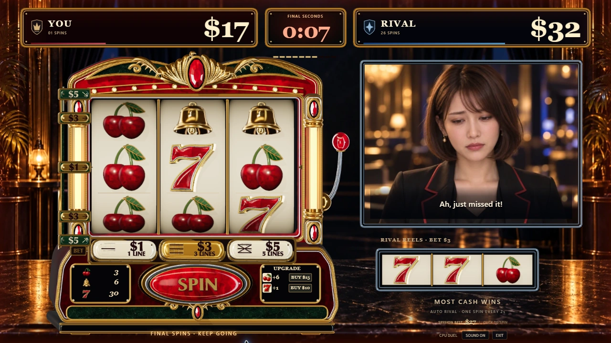

# Slot-chan

**60 seconds. Pick your bet. Beat a rival you can talk to.**

A desktop slot duel by **team donburi**, built for a game jam. Spin an ornate 3D machine, spend your winnings on reel upgrades, and compete against a rival who keeps playing independently. Optional OpenAI voice conversation gives the rivalry a personality.

**[Play the demo](https://slot-chan.vercel.app/) · [Submission answers](docs/game-jam-submission.md) · [3D models and source](art-source/houdini/) · [日本語](#日本語)**

Desktop only: **1280×720 or larger**, mouse and keyboard. English game UI. All dollar amounts are fictional game currency; there are no deposits or cash-outs.



*Actual local gameplay from the submission source snapshot, captured on September 14, 2026. [Capture and verification notes](docs/submission-verification.md).*

## Play a round

1. Choose **PLAY NOW**. CPU play needs no account, API key, invite, microphone, or database.
2. Both players start with **$30**. Choose **$1 / $3 / $5 BET** with the buttons or keys **1 / 2 / 3**. Higher bets activate more paylines.
3. Click **SPIN** or press **Space** after the reels stop. Every spin deducts its bet, then adds any winning-line payouts. Inputs during a spin are ignored; holding Space does not repeat.
4. The rival spins independently every **two seconds** while it has enough cash. Use the lower-right **UPGRADE** shop to add six cherries or one seven to your reels. Each product costs **$10 → $15 → $20**, with up to three purchases per round. Upgrades affect the next spin and reset on rematch.
5. Finish with more cash when the clock ends. Inspect **ROUND STATS**, then choose **REMATCH**. The normal round lasts **60 seconds**; an accepted extension adds ten seconds once.

| BET | Active paylines |
| --- | --- |
| $1 | Middle row |
| $3 | All three rows |
| $5 | All three rows and both diagonals |

Three matching cherries pay **$3**, bells **$6**, and sevens **$30** per active line. Multiple winning lines add together. Spending on upgrades reduces the same balance that determines victory. See [game rules](docs/game-rules.md) and [upgrade prices in code](shared/shop.ts).

CPU rounds can offer on-screen choices to borrow or lend $5, or extend a close finish. Voice mode also supports spoken requests, subject to the server's game rules. These are fictional in-game events.

## What OpenAI adds

- **A conversational rival:** OpenAI GPT-Live streams speech and transcripts using current match context. The implementation supports spoken replies, interruptions, and English/Japanese conversation. The server validates changes to money and time; the voice model does not choose reel outcomes.
- **Development support for real 3D objects:** Codex helped write and refine Houdini Python scripts for the cherries, bell, seven, coin, and cabinet. This included contours, bevels, normals, named mesh parts, and OBJ export, followed by Three.js materials, lighting, and animation. The editable generation scripts and exported models are in the repository.
- **Creative assets:** OpenAI image generation supplied project artwork and the rival's expression variants. The current rival has **18 expressions**. [Artwork provenance](docs/visual-assets.md) and [expression details](docs/rival-expressions.md) record their sources.

The game remains playable with the CPU rival when voice is unavailable. Codex also assisted with implementation, refactoring, browser checks, and fixes throughout development. See the [six submission answers](docs/game-jam-submission.md) for the judging criteria.

## Run locally

Use **Node.js 22.22 or newer in the Node 22 release line**, and npm.

```bash
git clone https://github.com/yuin15/donburi-g.git
cd donburi-g
npm ci
npm run dev
```

Open the URL printed by Vite. This starts the game and its local `/api/access` and `/api/ws` routes together. CPU play works immediately; simply starting the server or opening the page does not call an external AI service. Houdini is not needed to run the game because the exported models are included.

### Optional AI voice

At the entry screen, enter the organizer-provided invite under **ADD AI VOICE · OPTIONAL**, select **CONNECT AI VOICE**, allow the microphone, then start the round. **MIC**, **VOICE**, and **SOUND** separately control microphone input, rival speech, and game effects. Microphone audio is sent to OpenAI; live sessions consume the host's API usage allowance.

For your own local server, copy [`.env.example`](.env.example) to the ignored `.env.local` and configure these server-only settings:

| Setting | Purpose |
| --- | --- |
| `OPENAI_API_KEY` | An account with access to the configured voice model |
| `SESSION_SIGNING_KEY` | Random signing secret, at least 24 characters |
| `MVP_INVITE_CODE` | Your private voice invite |
| `LIVE_MODE_ENABLED=true` | Enable live sessions |
| `ALLOWED_ORIGINS` | Browser origin, including the port for local development |
| `GPT_LIVE_MODEL`, `GPT_LIVE_VOICE` | Defaults in this source: `gpt-live-1`, `marin` |
| `RIVAL_REASONING_MODEL` | Responses API classifier configuration; default `gpt-5.6-luna` |

The Responses API is used for a bounded loan-reply classification path; direct borrowing and time-extension requests have deterministic handlers. It does not control the CPU's normal bets or select reel outcomes.

**LiveAvatar video is hidden in the current demo UI.** Its integration and LiveKit playback code remain in the repository, but neither is required for the current voice-only experience. Redis/Upstash is also optional. Connection limits are process-local demo safeguards, not a global spending cap. See [operations](docs/operations.md).

## 3D production and architecture

The art workflow is reproducible: **Houdini Python scripts → exported OBJ parts → Three.js materials and animation → in-game visual review**. Codex supported changes to both the models and the code that displays them, making it possible to refine a shape after seeing it at actual reel size.

The cabinet and winning symbols use real meshes, with enamel, metallic edges, shadows, depth, and movement. During ordinary reel rotation, a shared atlas rendered from the 3D symbol models keeps the spinning strips efficient. Winning symbols lift out as meshes; coins, sculpted payout text, cabinet movement, and a large victory title reinforce the result. Geometry and materials are reused, motion can be reduced, and hidden tabs stop rendering. Sound effects are synthesized with Web Audio.

The TypeScript application uses **MVVM**:

| Directory | Responsibility |
| --- | --- |
| [`src/domain/`](src/domain/) | Model: reel stops, payouts, balances, purchases, clock |
| [`src/viewmodel/`](src/viewmodel/) | ViewModel: input, round flow, display state, CPU/live switching |
| [`src/view/`](src/view/) | View: Three.js scenes, DOM controls, effects, sound |
| [`src/client/`](src/client/) | Game transport, microphone, audio, retained video integration |
| [`server/`](server/) / [`api/`](api/) | Live sessions, provider connections, validated game actions |
| [`art-source/houdini/`](art-source/houdini/) | Model-generation scripts, OBJ exports, model viewers |

[Architecture](docs/architecture.md) · [Model regeneration](art-source/houdini/README.md) · [3D win presentation](docs/physical-win-presentation.md) · [Coin celebrations](docs/coin-celebrations.md) · [Victory title](docs/victory-title.md)

## Submission status and checks

Documentation reviewed against **`main` at `b1806b5` (PR #159), September 14, 2026**. The submission notes record the source and the actual checks, so older screenshots and release records are not mistaken for the latest build. The hosted demo is linked above; a local checkout reproduces the submitted source.

```bash
npm run typecheck
npm run lint
npm test
npm run check:server-runtime
npm run build
```

GitHub Actions runs these checks. [Submission verification](docs/submission-verification.md) records the current browser check; [voice evidence](docs/voice-spike.md) records earlier real-provider sessions. **The latest conversation changes have not been re-evaluated with a human microphone in this documentation update.** Desktop Chrome is the main review target; mobile support is outside this demo's scope. Session best and streaks reset on page reload.

## Credits, licenses, and handoff

See [third-party notices](THIRD_PARTY_NOTICES.md) for dependency licenses, the HeyGen reference integration, the font license, and artwork provenance. Houdini assets were made with **Apprentice**, whose terms restrict use to non-commercial projects; no commercial-use clearance is claimed. This repository currently has no blanket open-source license for project-owned code or art.

Never commit keys, invites, environment files, personal email addresses, microphone recordings, or actual conversations. Use a separate secure channel for private setup. [Security](SECURITY.md) · [Team handoff, Japanese](docs/demo-handoff.md) · [Development policy](AGENTS.md)

---

## 日本語

**60秒。BETを選び、話せるライバルと勝負する。**

**チームdonburi**のゲームソン向けPC用スロット対戦ゲームです。立体の筐体を自分で回し、強化に使うお金と勝利に残すお金を考えながら、独立して回転するライバルと競います。任意のOpenAI音声会話で、相手とのやり取りも楽しめます。

**[公開デモ](https://slot-chan.vercel.app/) · [提出用の英語回答6項目](docs/game-jam-submission.md) · [3Dモデルと制作元](art-source/houdini/)**

対象は**PC、1280×720以上、マウス・キーボード**。ゲーム画面は英語です。ドル表示はすべてゲーム内の架空通貨で、入金・換金はありません。

### 遊び方

1. **PLAY NOW**で開始。CPU対戦にはアカウント・APIキー・招待・マイク・DBは不要です。
2. 両者は**$30**から開始。ボタンまたは**1 / 2 / 3**キーで**$1 / $3 / $5 BET**を選びます。$1は中央1ライン、$3は横3ライン、$5は横3ラインと斜め2ラインが有効です。
3. リール停止後に**SPIN**をクリック、または**Space**で回転。BETを支払い、当たったラインの配当を残高に加えます。回転中の入力は予約されず、長押しも連続回転になりません。
4. ライバルは残高が続く限り**2秒ごと**に回転します。右下の**UPGRADE**からチェリー6枚追加・7を1枚追加を購入できます。各商品は**$10 → $15 → $20**で最大3回。次の回転から反映され、再戦でリセットします。
5. 時間切れのときに残高が多い方が勝利。**ROUND STATS**で結果を見て、**REMATCH**で再戦できます。通常は**60秒**、延長が成立すると一度だけ10秒追加されます。

有効ラインに同じ絵柄が3つ揃うと、チェリー**$3**、ベル**$6**、7**$30**。複数ラインは合算します。強化の購入費も勝敗に使う残高から支払います。CPU対戦には$5の貸し借りや終盤の延長を選ぶ場面があり、音声対戦ではサーバー側の規則に従って発話による依頼も扱います。[ゲーム規則](docs/game-rules.md)。

### OpenAIの活用

- **音声で反応するライバル：** GPT-Liveへ対戦状況を渡し、音声と字幕で返答します。割り込みと英語・日本語の会話に対応する実装を備えます。金額・時間の変更はサーバーが検証し、音声モデルがリールの結果を決めることはありません。
- **3Dオブジェクトの開発支援：** CodexでHoudini用Pythonスクリプトを作成・改善し、チェリー・ベル・7・コイン・筐体を制作しました。輪郭、面取り、法線、部位の分割、OBJ出力から、Three.jsでの材質・照明・アニメーションまで支援を受けています。生成スクリプトと出力モデルをリポジトリに収録しています。
- **素材制作：** OpenAI画像生成を背景やライバルの表情に使用。現在は**18表情**です。[素材の出所](docs/visual-assets.md)と[表情の仕様](docs/rival-expressions.md)を記録しています。

Codexは実装、MVVMへの整理、ブラウザ確認、不具合修正にも活用しました。音声を使えない場合もCPU対戦を遊べます。

### ローカル起動と音声設定

**Node.js 22系の22.22以上**とnpmを用意します。

```bash
git clone https://github.com/yuin15/donburi-g.git
cd donburi-g
npm ci
npm run dev
```

表示されたURLを開くとCPU対戦ができます。画面とローカルAPIをまとめて起動し、起動・ページ表示だけでは外部AI APIを呼びません。モデルを同梱しているため、ゲームの起動にHoudiniは不要です。

音声は入口の**ADD AI VOICE · OPTIONAL**で主催者から受け取った招待コードを入力し、**CONNECT AI VOICE**、マイク許可、対戦開始の順に進みます。**MIC / VOICE / SOUND**でマイク入力・相手の声・効果音を別々に操作できます。マイク音声はOpenAIへ送信され、ホスト側のAPI利用枠を消費します。

自分の環境で音声を動かす場合は[`.env.example`](.env.example)をGit対象外の`.env.local`へコピーし、上の英語版の設定表にあるキー・署名鍵・招待コード・Origin・有効化設定を入力します。既定の音声モデルは`gpt-live-1`、声は`marin`です。Responses APIは貸し借りの返答を分類する限定的な経路で使用し、直接の借入・延長依頼は決定的な処理を使います。

**現在のデモではLiveAvatar映像の選択項目を非表示にしています。** 実装は残していますが、音声のみの体験には不要です。Redis/Upstashも必須ではありません。プロセス内の接続制限はデモ用で、全体の課金上限を保証するものではありません。[運用手順](docs/operations.md)。

### 3D制作と構成

**HoudiniのPythonスクリプト → OBJ出力 → Three.jsの材質・演出 → 実ゲームで確認**という流れで制作しています。モデルと表示コードの両方をCodexで改善し、リール内の実際の大きさで見ながら形状を調整しました。

筐体と当たり時の絵柄は実メッシュを使い、塗装、金属の縁、影、奥行き、動きを表現します。回転中の絵柄は3Dモデルから生成した共有アトラスで描画。当たり時には絵柄がせり出し、立体の獲得数字、コイン、筐体の動き、大きな勝利文字が連動します。形状・材質の再利用、動きを減らす設定、非表示タブでの描画停止に対応。効果音はWeb Audioで合成しています。

TypeScript / Vite / Three.jsを使用し、**MVVM**でゲーム規則・進行・描画を分離しています。`src/domain/`がModel、`src/viewmodel/`がViewModel、`src/view/`がView、`src/client/`が通信・音声、`server/`と`api/`がライブ接続を担当します。

[構成の詳細](docs/architecture.md) · [モデルの再生成](art-source/houdini/README.md) · [コイン演出](docs/coin-celebrations.md) · [勝利文字](docs/victory-title.md)

### 提出時点・確認範囲・利用条件

**2026年9月14日、`main`の`b1806b5`（PR #159）を基準に整理**しました。今回の実画面と確認内容は[提出用の確認記録](docs/submission-verification.md)へ、過去の実API確認は[音声の記録](docs/voice-spike.md)へ分けています。最新の会話修正について、今回の資料更新では実マイクの体感評価を行っていません。主な画面確認対象はPC版Chromeで、スマートフォン対応は対象外です。自己ベストと連勝は再読み込みでリセットします。

GitHub Actionsでは型検査・lint・既存テスト・サーバー実行確認・本番ビルドを実行します。ローカル用の確認コマンドは英語版に記載しています。

依存ライブラリ、参考実装、フォント、素材の出所は[THIRD_PARTY_NOTICES.md](THIRD_PARTY_NOTICES.md)を参照してください。Houdiniモデルは**Apprenticeの非商用条件**で制作しており、商用利用の許諾を取得済みとは扱いません。本プロジェクト独自のコード・素材には、リポジトリ全体を対象とするオープンソースライセンスを設定していません。

秘密鍵、APIキー、招待コード、環境ファイル、個人メール、マイク音声、実際の会話はコミットせず、安全な別経路で引き継いでください。[セキュリティ](SECURITY.md) · [メンバー向け引き継ぎ](docs/demo-handoff.md) · [開発方針](AGENTS.md)
