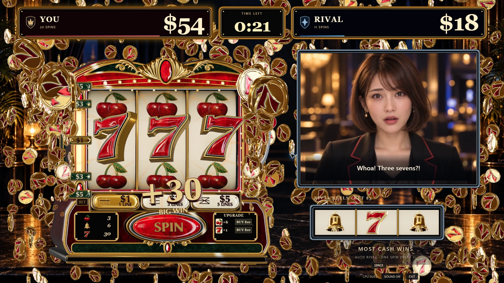
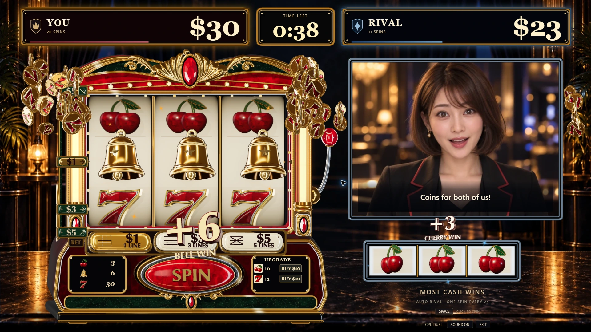

# Slot-chan

**Talk to your AI rival while you play a 60-second slot duel.**

A desktop game by **team donburi** where conversation and competition happen together. Keep spinning, change your bet, and talk with your opponent about the match as it unfolds. OpenAI voice gives the rival a conversational presence: banter, reactions, and spoken requests become part of playing together. An ornate 3D machine and expressive character bring that rivalry to the screen.

**[Watch the 60-second demo](https://drive.google.com/file/d/1hzdZMva8uin2Kk6c68QsRGulelmyhQWu/view?usp=sharing) · [Play Slot-chan](https://slot-chan.vercel.app/) · [Submission answers](docs/game-jam-submission.md) · [日本語](#日本語)**

Desktop only: **1280×720 or larger**, mouse and keyboard, with **WebGL enabled**. Desktop Chrome is the main review target. English game UI; voice conversation supports English and Japanese. All dollar amounts are fictional game currency; there are no deposits or cash-outs.

[](docs/evidence/readme-3d-2026-09-14/seven-win-1920.webp)

*A seven win, rendered by the game at 1920×1080. All three screenshots use reproducible local review scenes, captured on September 14, 2026. [Capture notes](docs/submission-verification.md#readme-3d-gallery).*

## For judges — start here

1. **[Watch the 60-second video](https://drive.google.com/file/d/1hzdZMva8uin2Kk6c68QsRGulelmyhQWu/view?usp=sharing)** for a quick introduction to conversation during play and the 3D presentation. No Google sign-in is needed.
2. **[Open the playable demo](https://slot-chan.vercel.app/).** To experience the central feature, enter a private invite under **ADD AI VOICE · OPTIONAL**, choose **CONNECT AI VOICE**, allow microphone access, and start the round. If you do not have an invite, request one from **team donburi**; codes are not published in this repository.
3. **Talk while spinning.** Try “Think you can beat me?”, “Can you lend me five dollars?”, or “Can we play ten more seconds?” These are example prompts, not guaranteed responses. Accepted money/time requests are applied through the game's rules.
4. **No invite or microphone? Choose PLAY NOW** for the CPU game, and use the video to see the conversational experience. CPU dialogue is scripted, not a live AI conversation.

Voice depends on the host's API access and available session allowance. Headphones are recommended to reduce microphone echo. **MIC / VOICE / SOUND** control your microphone, rival speech, and game effects separately. Microphone audio is sent to OpenAI.

## Talk while you play

Use your mouse or keyboard to play while speaking to the rival through your microphone. React to a win, ask about the opponent's chances, or request ten more seconds: the conversation takes place during the duel. The rival receives current match context, so replies can relate to the changing situation. The game keeps running while you talk; you do not need to open a chat box or stop spinning to type.

The rival competes through independent spins and responds through voice and **18 character expressions**. Speech gives the match its personality; deterministic game rules, rather than the language model, control balances, legal actions, and payout calculations. Reel outcomes are randomized by the game, not chosen by the AI.

## Winning moments

| Bell win | Match victory |
| --- | --- |
| [](docs/evidence/readme-3d-2026-09-14/bell-win-1920.webp) | [](docs/evidence/readme-3d-2026-09-14/victory-1920.webp) |
| Polished bells, raised symbols, and wins on both machines. | Sculpted gold lettering and a screen-filling coin celebration. |

Click any image to inspect the full-size capture.

## Play a round

1. Choose **PLAY NOW**. CPU play needs no account, API key, invite, microphone, or database.
2. Both players start with **$30**. Choose **$1 / $3 / $5 BET** with the buttons or keys **1 / 2 / 3**. Higher bets activate more paylines.
3. Click **SPIN** or press **Space** after the reels stop. Every spin deducts its bet, then adds any winning-line payouts. Inputs during a spin are ignored; holding Space does not repeat.
4. The rival spins independently every **two seconds** while it has enough cash. Use the lower-right **UPGRADE** shop to add six cherries or one seven to your reels. Each product costs **$10 → $15 → $20**, with up to three purchases per round. Upgrades affect the next spin and reset on rematch.
5. Finish with more cash when the clock ends. Inspect **ROUND STATS**, then choose **REMATCH**. The normal round lasts **60 seconds**. Each distinct accepted time-extension agreement in live mode adds **ten seconds**, within the session's limits; the CPU round's **EXTEND** card remains a one-time choice available with **15 seconds or less** remaining.

| BET | Active paylines |
| --- | --- |
| $1 | Middle row |
| $3 | All three rows |
| $5 | All three rows and both diagonals |

Three matching cherries pay **$3**, bells **$6**, and sevens **$30** per active line. Multiple winning lines add together. Spending on upgrades reduces the same balance that determines victory. See [game rules](docs/game-rules.md) and [upgrade prices in code](shared/shop.ts).

CPU rounds can offer on-screen choices to borrow or lend $5, or extend a close finish. Voice mode also supports spoken requests, subject to the server's game rules. These are fictional in-game events.

## How OpenAI enables the experience

- **Conversation during active play:** OpenAI GPT-Live streams microphone input, rival speech, and transcripts while the game continues. Current balances, remaining time, and confirmed outcomes provide context for replies. Players can respond to the rival while operating the controls. This shared conversation is central to the game's appeal.
- **Spoken interaction with the match:** Received rival speech streams without waiting for agreement classification, once preceding playback is complete. The exact forwarded audio is transcribed with `gpt-transcribe`, then Responses API classification settles spoken agreements in the background. A validated agreement transfers a fixed $5 in either direction or adds ten seconds, subject to game/session limits. The game code retains control of balances, time, and reel outcomes.
- **Development support:** Codex assisted the voice integration, implementation, refactoring, and debugging, as well as 3D model scripts, mesh corrections, export, and Three.js integration. Included scripts and models support further visual iteration.
- **Creative assets:** OpenAI image generation supplied project artwork and the rival's expression variants. The current rival has **18 expressions**. [Artwork provenance](docs/visual-assets.md) and [expression details](docs/rival-expressions.md) record their sources.

The game remains playable with the CPU rival when voice is unavailable. See the [six submission answers](docs/game-jam-submission.md) for the judging criteria, [current verification scope](#submission-status-and-checks), and [historical voice evidence](docs/voice-spike.md). The six answers were updated on September 15 to align with the voice behavior and private-invite instructions described here.

<details>
<summary>Latest conversation refinements — September 15</summary>

The September 15 source includes the [voice-playback fixes in PR #166](https://github.com/yuin15/donburi-g/pull/166):

- Received replies no longer wait for the extra pause intended for unsolicited commentary; preceding speech is still allowed to finish.
- Microphone-volume activity alone no longer cuts off the rival's queued audio, protecting sentence endings from noise or short acknowledgements.
- A new request during continuous rival speech is associated with its own agreement processing, without discarding the previous audio.
- The closing reaction waits for playback completion, with bounded timeouts, before the session closes.

These behaviors have automated regression coverage in [voice playback tests](server/voicePlayback.test.ts) and [bridge tests](server/gptLive.test.ts). See [verification scope and known limits](#submission-status-and-checks) below.

</details>

## Run locally

Use **Node.js 22.22 or newer in the Node 22 release line**, and npm.

```bash
git clone https://github.com/yuin15/donburi-g.git
cd donburi-g
npm ci
npm run dev
```

Open the URL printed by Vite. This starts the game and its local `/api/access` and `/api/ws` routes together. CPU play works immediately; simply starting the server or opening the page does not call an external AI service. No 3D authoring software is needed to run the game because the exported models are included.

### Voice setup

For the hosted demo, use a private invite from team donburi and follow the [judge quick start](#for-judges--start-here). No personal API key is needed to use the hosted demo. Live sessions consume the host's API usage allowance.

<details>
<summary>Self-hosting: environment settings and voice architecture</summary>

For your own local server, copy [`.env.example`](.env.example) to the ignored `.env.local` and configure these server-only settings:

| Setting | Purpose |
| --- | --- |
| `OPENAI_API_KEY` | An account with access to the configured voice model |
| `SESSION_SIGNING_KEY` | Random signing secret, at least 24 characters |
| `MVP_INVITE_CODE` | Your private voice invite |
| `LIVE_MODE_ENABLED=true` | Enable live sessions |
| `ALLOWED_ORIGINS` | Browser origin, including the port for local development |
| `GPT_LIVE_MODEL`, `GPT_LIVE_VOICE` | Defaults in this source: `gpt-live-1`, `marin` |
| `RIVAL_REASONING_MODEL` | Responses API classifier configuration; default `gpt-5.6-luna` |

Ordinary voice streams as soon as preceding playback has finished and does not wait for agreement classification. Display captions stream independently; agreement settlement uses the exact forwarded 24 kHz PCM16 mono audio, sent as an in-memory WAV to `gpt-transcribe`, followed by Responses API classification alongside the relevant player turn and offer context. This adds transcription API requests and usage, and balances or time may update several seconds after the speech.

In live mode, a validated agreement moves a fixed $5 in either direction even if the lender's balance becomes negative, or adds ten seconds for each distinct accepted extension, within the game/session limits. Server-issued turn and offer IDs prevent duplicate application, including repeated affirmatives to the same offer. New speech does not cancel an already forwarded agreement. Background processing uses bounded retries and explicitly reports exhausted failures; pending settlement delays the final result only for a bounded interval. These APIs do not control normal CPU bets or select reel outcomes. Offline CPU play and its one-time **EXTEND** card at 15 seconds or less are unchanged.

**LiveAvatar video is hidden in the current demo UI.** Its integration and LiveKit playback code remain in the repository, but neither is required for the current voice-only experience. Redis/Upstash is also optional. Connection limits are process-local demo safeguards, not a global spending cap. See [operations](docs/operations.md).

</details>

## 3D production and architecture

3D production uses **Blender and Houdini**, with a workflow of **modeling and scripting → asset export → Three.js integration → in-game visual review**. Codex supported changes to both the models and the code that displays them, making it possible to refine shapes, materials, and movement at actual game size. The repository includes procedural generation scripts and OBJ exports.

The cabinet and winning symbols use real meshes, with enamel, metallic edges, shadows, depth, and movement. During ordinary reel rotation, a shared atlas rendered from the 3D symbol models keeps the spinning strips efficient. Winning symbols lift out as meshes; coins, sculpted payout text, cabinet movement, and a large victory title reinforce the result. Geometry and materials are reused, motion can be reduced, and hidden tabs stop rendering. Sound effects are synthesized with Web Audio.

The TypeScript application uses **MVVM**:

| Directory | Responsibility |
| --- | --- |
| [`src/domain/`](src/domain/) | Model: reel stops, payouts, balances, purchases, clock |
| [`src/viewmodel/`](src/viewmodel/) | ViewModel: input, round flow, display state, CPU/live switching |
| [`src/view/`](src/view/) | View: Three.js scenes, DOM controls, effects, sound |
| [`src/client/`](src/client/) | Game transport, microphone, audio, retained video integration |
| [`server/`](server/) / [`api/`](api/) | Live sessions, provider connections, validated game actions |
| [`art-source/houdini/`](art-source/houdini/) | Model-generation scripts, OBJ exports, model viewers |

[Architecture](docs/architecture.md) · [Model regeneration](art-source/houdini/README.md) · [3D win presentation](docs/physical-win-presentation.md) · [Coin celebrations](docs/coin-celebrations.md) · [Victory title](docs/victory-title.md)

## Submission status and checks

README updated on **September 15, 2026**, against game source **[`5baa4fc`](https://github.com/yuin15/donburi-g/commit/5baa4fc24add47cbfefd30d51ebe4a2887b658f2)** on `main` (including PR #166). This is the source revision reviewed before this README-only update, not a claim that every hosted asset or recording comes from that exact commit.

| Evidence | What was verified |
| --- | --- |
| [Source CI](https://github.com/yuin15/donburi-g/actions/runs/34915846832) | Successful run for `5baa4fc`: secret-pattern check, type checks, lint, tests, server-runtime check, and production build. |
| [60-second video](https://drive.google.com/file/d/1hzdZMva8uin2Kk6c68QsRGulelmyhQWu/view?usp=sharing) | Replacement recording; after the sharing update on September 15, Google Drive playback worked without sign-in and the player showed a 1:00 duration. It is not a measured latency benchmark. |
| [Hosted demo](https://slot-chan.vercel.app/) | Entry page and voice/CPU controls were accessible on September 15. The review browser had WebGL disabled, so a full hosted playthrough was not completed in that check. |
| [Screenshots and earlier CPU playthrough](docs/submission-verification.md) | September 14 observations, with source revisions and reproducible gallery scenes recorded separately. |
| [Earlier provider checks](docs/voice-spike.md) | Historical voice-session evidence, not a fresh human microphone evaluation of the latest changes. |

To run the same code checks locally:

```bash
npm run typecheck
npm run lint
npm test
npm run check:server-runtime
npm run build
```

**Known limits:** live voice depends on provider access, network conditions, and session allowance; captions and agreement updates can lag speech. This README update did not include a fresh human microphone evaluation of the latest changes. Mobile support is outside this demo's scope. Session best and streaks reset on page reload. If the 3D scene cannot initialize, check that WebGL is available in your browser; the recorded video remains an alternative way to review the presentation.

## Credits, licenses, and handoff

See [third-party notices](THIRD_PARTY_NOTICES.md) for dependency licenses, the HeyGen reference integration, the font license, and artwork provenance, including tool-specific and non-commercial asset conditions. This repository currently has no blanket open-source license for project-owned code or art.

Never commit keys, invites, environment files, personal email addresses, microphone recordings, or actual conversations. Use a separate secure channel for private setup. [Security](SECURITY.md) · [Team handoff, Japanese](docs/demo-handoff.md) · [Development policy](AGENTS.md)

---

## 日本語

**ライバルと会話しながら遊ぶ、60秒のスロット対戦。**

**チームdonburi**の、会話と勝負を一緒に楽しむPC用ゲームです。自分でリールを回し、BETを変えながら、進行中の勝負について相手と話せます。OpenAIの音声で、軽口、当たりへの反応、お願いといったやり取りが遊びの一部になります。立体の筐体と表情豊かなキャラクターが、対戦相手の存在感を支えます。

**[60秒の紹介動画](https://drive.google.com/file/d/1hzdZMva8uin2Kk6c68QsRGulelmyhQWu/view?usp=sharing) · [公開デモ](https://slot-chan.vercel.app/) · [提出用の英語回答6項目](docs/game-jam-submission.md) · [3Dモデルと制作元](art-source/houdini/)**

対象は**PC、1280×720以上、マウス・キーボード、WebGLが有効なブラウザ**。主な確認対象はPC版Chromeです。ゲーム画面は英語、音声会話は英語・日本語に対応しています。ドル表示はすべてゲーム内の架空通貨で、入金・換金はありません。

### 審査員の方へ

1. まず[60秒の紹介動画](https://drive.google.com/file/d/1hzdZMva8uin2Kk6c68QsRGulelmyhQWu/view?usp=sharing)で、会話しながら遊ぶ様子と3D演出をご覧ください。Googleへのログインは不要です。
2. [公開デモ](https://slot-chan.vercel.app/)の**ADD AI VOICE · OPTIONAL**に招待コードを入力し、**CONNECT AI VOICE → マイク許可 → 対戦開始**で会話を試せます。コードをお持ちでない場合は**チームdonburi**へお問い合わせください。招待コードはリポジトリに公開していません。
3. スロットを回しながら「勝てそう？」「5ドル貸して」「あと10秒延長しない？」などと話しかけてみてください。返答は固定ではなく、貸し借り・延長は合意が検証されるとゲームの規則に従って反映されます。
4. 招待やマイクなしでも**PLAY NOW**でCPU対戦を遊べます。CPUの台詞は固定のゲーム内台詞で、ライブAI会話ではありません。会話の様子は動画で確認できます。

マイクの回り込みを減らすため、ヘッドホンを推奨します。**MIC / VOICE / SOUND**でマイク入力・相手の声・効果音を別々に切り替えられます。音声の利用にはホスト側のAPI設定と利用枠が必要で、マイク音声はOpenAIへ送信されます。

冒頭と[当たり演出のギャラリー](#winning-moments)に、7揃い・ベル揃い・勝利演出の3枚を掲載しています。いずれもローカルの確認用シーンをゲーム内で描画した1920×1080の実画面です。画像をクリックすると原寸で見られます。

### 会話しながら遊ぶ

マウス・キーボードで操作しながら、マイクでライバルに話しかけます。当たりを喜ぶ、相手の勝算を聞く、あと10秒ほしいと頼む。進行中の対戦に会話が重なり、現在の残高や残り時間、確定した出目を踏まえて返答できます。文字入力用の画面に切り替える必要はありません。

ライバルは独立してリールを回し、声と**18種類の表情**で反応します。残高・許可される操作・配当はゲームコードが管理し、リールの抽選結果をAIが選ぶことはありません。

### 遊び方

1. **PLAY NOW**で開始。CPU対戦にはアカウント・APIキー・招待・マイク・DBは不要です。
2. 両者は**$30**から開始。ボタンまたは**1 / 2 / 3**キーで**$1 / $3 / $5 BET**を選びます。$1は中央1ライン、$3は横3ライン、$5は横3ラインと斜め2ラインが有効です。
3. リール停止後に**SPIN**をクリック、または**Space**で回転。BETを支払い、当たったラインの配当を残高に加えます。回転中の入力は予約されず、長押しも連続回転になりません。
4. ライバルは残高が続く限り**2秒ごと**に回転します。右下の**UPGRADE**からチェリー6枚追加・7を1枚追加を購入できます。各商品は**$10 → $15 → $20**で最大3回。次の回転から反映され、再戦でリセットします。
5. 時間切れのときに残高が多い方が勝利。**ROUND STATS**で結果を見て、**REMATCH**で再戦できます。通常は**60秒**。音声対戦ではゲーム・セッションの上限内で、新しい延長合意ごとに**10秒**追加されます。CPU対戦の**EXTEND**カードは従来どおり**残り15秒以内・一度だけ**です。

有効ラインに同じ絵柄が3つ揃うと、チェリー**$3**、ベル**$6**、7**$30**。複数ラインは合算します。強化の購入費も勝敗に使う残高から支払います。CPU対戦には$5の貸し借りや終盤の延長を選ぶ場面があり、音声対戦ではサーバー側の規則に従って発話による依頼も扱います。[ゲーム規則](docs/game-rules.md)。

### OpenAIの活用

- **進行中の対戦と会話の両立：** GPT-Liveでマイク入力、相手の声、字幕をストリーミングしながらゲームが進みます。現在の残高、残り時間、確定した出目を会話の文脈として渡し、操作しながら話しかけたり、相手の発言へ返したりできます。この「一緒に話しながら遊ぶ」体験が企画の中心です。
- **会話からゲームへの働きかけ：** 受信した返答音声は、前の音声の再生完了後、合意判定を待たずに流します。実際に送出したPCMを`gpt-transcribe`で文字起こしし、Responses APIによる分類で合意を後から反映します。ゲーム・セッションの規則に従い、検証された合意で固定$5の移動または10秒の延長を行います。残高・時間・リールの結果はゲームコードが管理します。
- **開発支援：** Codexを音声統合、実装、構成整理、不具合修正に活用。3Dでも制作スクリプト、メッシュ修正、書き出し、Three.jsへの統合を支援しています。制作スクリプトと出力モデルを収録し、見た目を継続して改善できるようにしています。
- **素材制作：** OpenAI画像生成を背景やライバルの表情に使用。現在は**18表情**です。[素材の出所](docs/visual-assets.md)と[表情の仕様](docs/rival-expressions.md)を記録しています。

音声を使えない場合もCPU対戦を遊べます。[提出用の6項目](docs/game-jam-submission.md)は9月15日に更新し、このREADMEの音声動作・非公開の招待コードの案内に合わせています。[音声の記録](docs/voice-spike.md)は過去の確認記録として残しています。

<details>
<summary>最新の会話改善 — 9月15日</summary>

9月15日のソースには[PR #166](https://github.com/yuin15/donburi-g/pull/166)の修正が入っています。

- 受信した返答音声に、自発的な話しかけ用の追加待機をかけないようにしました。前の音声の再生は最後まで待ちます。
- マイクの音量反応だけで相手の音声を切らず、語尾を保護するようにしました。
- 相手が続けて話している途中の新しい依頼も、それに対応する合意として処理するようにしました。
- 試合終了時の一言は、上限時間を設けつつ再生完了を待ってから接続を閉じるようにしました。

これらは[音声再生](server/voicePlayback.test.ts)・[音声接続](server/gptLive.test.ts)の自動回帰テストで確認しています。確認範囲と既知の制限は下記に記載しています。

</details>

### ローカル起動と音声設定

**Node.js 22系の22.22以上**とnpmを用意します。

```bash
git clone https://github.com/yuin15/donburi-g.git
cd donburi-g
npm ci
npm run dev
```

表示されたURLを開くとCPU対戦ができます。画面とローカルAPIをまとめて起動し、起動・ページ表示だけでは外部AI APIを呼びません。モデルを同梱しているため、ゲームの起動に3D制作ソフトは不要です。

公開デモの音声利用は、チームdonburiの招待コードを使って上記「審査員の方へ」の手順で接続します。利用者自身のAPIキーは不要です。ホスト側のAPI利用枠を消費します。

<details>
<summary>自分のサーバーで音声を動かす場合の設定・技術詳細</summary>

自分の環境で音声を動かす場合は[`.env.example`](.env.example)をGit対象外の`.env.local`へコピーし、上の英語版の設定表にあるキー・署名鍵・招待コード・Origin・有効化設定を入力します。既定の音声モデルは`gpt-live-1`、声は`marin`です。

通常音声は前の音声の再生完了後、合意判定を待たずに再生し、字幕も独立して表示します。合意の反映には、実際に送出した24 kHz・PCM16・モノラル音声をメモリ内WAVとして`gpt-transcribe`へ送り、その文字起こしと元のプレイヤー発話・提案の文脈をResponses APIで分類します。文字起こしAPIの呼び出しと利用量が追加され、会話の数秒後に残高や時間が更新される場合があります。

音声対戦では、検証された合意ごとに残高不足でも固定$5を双方いずれかへ移動し、時間はゲーム・セッションの上限内で新しい延長合意ごとに+10秒です。同じ提案への重複した「はい」はサーバー発行のturn／offer IDで一度だけ扱います。新しい発話で送出済みの合意を取り消さず、後処理は回数を限って再試行し、失敗し尽くした場合は明示します。試合終了前の未完了処理も有限の範囲で待機します。オフラインCPU対戦と、残り15秒以内に一度だけ選べるEXTENDカードは変わりません。

**現在のデモではLiveAvatar映像の選択項目を非表示にしています。** 実装は残していますが、音声のみの体験には不要です。Redis/Upstashも必須ではありません。プロセス内の接続制限はデモ用で、全体の課金上限を保証するものではありません。[運用手順](docs/operations.md)。

</details>

### 3D制作と構成

3D制作には**BlenderとHoudini**を使用し、**モデリング・スクリプト → 素材の書き出し → Three.jsへの統合 → 実ゲームで確認**という流れで進めています。モデルと表示コードの両方をCodexで改善し、ゲーム内の実際の大きさで見ながら形状・材質・動きを調整しました。リポジトリにはプロシージャル生成のスクリプトとOBJを収録しています。

筐体と当たり時の絵柄は実メッシュを使い、塗装、金属の縁、影、奥行き、動きを表現します。回転中の絵柄は3Dモデルから生成した共有アトラスで描画。当たり時には絵柄がせり出し、立体の獲得数字、コイン、筐体の動き、大きな勝利文字が連動します。形状・材質の再利用、動きを減らす設定、非表示タブでの描画停止に対応。効果音はWeb Audioで合成しています。

TypeScript / Vite / Three.jsを使用し、**MVVM**でゲーム規則・進行・描画を分離しています。`src/domain/`がModel、`src/viewmodel/`がViewModel、`src/view/`がView、`src/client/`が通信・音声、`server/`と`api/`がライブ接続を担当します。

[構成の詳細](docs/architecture.md) · [モデルの再生成](art-source/houdini/README.md) · [コイン演出](docs/coin-celebrations.md) · [勝利文字](docs/victory-title.md)

### 提出時点・確認範囲・利用条件

**2026年9月15日、`main`の[`5baa4fc`](https://github.com/yuin15/donburi-g/commit/5baa4fc24add47cbfefd30d51ebe4a2887b658f2)（PR #166まで）を基準に更新**しました。README更新直前に確認したゲームソースの版であり、公開デモや動画がすべて同じコミットから作成されたと保証するものではありません。

- 対象ソースの[CIは成功](https://github.com/yuin15/donburi-g/actions/runs/34915846832)しています。秘密情報パターン検査、型検査、lint、テスト、サーバー実行確認、本番ビルドを実行しています。
- 9月15日に動画を新しいURLへ差し替え、共有設定の更新後に新動画のログインなし再生と1:00の尺を確認しました。公開デモは入口画面を確認しています。確認用ブラウザではWebGLが無効だったため、この確認で公開版の通しプレイは完了していません。
- 9月14日のCPU実プレイ・ギャラリーは[以前の確認記録](docs/submission-verification.md)、過去の実API確認は[音声の記録](docs/voice-spike.md)へ分けています。最新の会話修正について、今回のREADME更新では実マイクの体感評価を行っていません。

**既知の制限：** 音声はAPI接続・通信環境・利用枠に依存し、字幕や合意の反映が音声より遅れる場合があります。スマートフォン対応は対象外です。自己ベストと連勝は再読み込みでリセットします。3D画面が起動しない場合はWebGLの利用可否を確認するか、紹介動画をご覧ください。ローカル用の確認コマンドは英語版に記載しています。

依存ライブラリ、参考実装、フォント、素材の出所は[THIRD_PARTY_NOTICES.md](THIRD_PARTY_NOTICES.md)を参照してください。制作ツールごとの条件や非商用素材の利用条件も記載しています。本プロジェクト独自のコード・素材には、リポジトリ全体を対象とするオープンソースライセンスを設定していません。

秘密鍵、APIキー、招待コード、環境ファイル、個人メール、マイク音声、実際の会話はコミットせず、安全な別経路で引き継いでください。[セキュリティ](SECURITY.md) · [メンバー向け引き継ぎ](docs/demo-handoff.md) · [開発方針](AGENTS.md)
