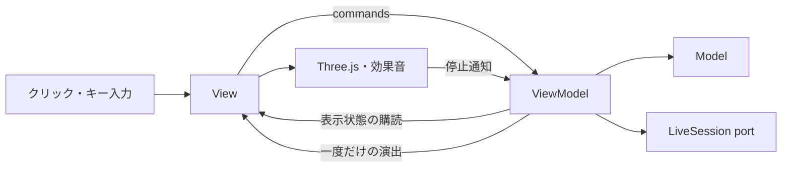

# Slot-chanのMVVM構成

画面や操作を改善するときに、抽選・通信・後始末を同じファイルで変更しないための分割。新しいフレームワークは追加しない。

| 場所 | 責務 | 主な変更例 |
| --- | --- | --- |
| `src/domain/` | Model。抽選、配当、独立回転、60秒の規則と集計 | 配当や回転間隔を変える |
| `src/viewmodel/GameViewModel.ts` | 対戦進行、CPU/Liveイベント、手動回転予約、タイマー、購読できる表示状態 | 操作の受付条件や試合の流れを変える |
| `src/viewmodel/GameViewState.ts` | 表示状態・操作・時計・一度だけの演出の型 | ViewとViewModelの接点を追加する |
| `src/view/GameView.ts` | 状態からDOMを更新し、入力・フォーカス・描画と音の実行を扱う | 配置、表示書式、キーボード操作を変える |
| `src/view/GameTemplate.ts`、CSS、`ReelScene` | HTMLとPCレイアウト、Three.jsの描画 | パネルや筐体、絵柄、演出を変える |
| `src/client/LiveSession.ts`、`live.ts` | 型付き通信portとブラウザの音声・映像アダプター | 接続方法やメディア処理を変える |
| `src/client/LiveAudioPlayer.ts` | 映像なしのPCM音声再生、消音、割り込み時の再生待ち破棄 | 音声再生の遅延や後始末を変える |
| `src/dev/GameReview.ts`、`VisualReview.ts` | DEV専用の固定画面・回転動画の検収 | 表示例を追加する |
| `src/main.ts` | View・ViewModel・依存関係を生成し、接続・破棄する | 起動時の依存を差し替える |

`snapshot`は確定済みの試合情報、`scores`はリール停止後に見せる得点。同じ変数にまとめない。`RoundPresentation`が停止通知と結果到着の順序を調整し、左右別の停止通知を待ち、最後の出目が見える前に結果へ飛ばないようにする。`GamePresentation.playSpin`と`ReelScene.playSide`は片側だけを扱い、相手の回転を中断しない。

状態購読は再描画用。回転開始・効果音・結果の金貨は`GamePresentation`経由で一度だけ実行する。100msごとの表示更新で再生し直さない。Viewは結果詳細の開閉やフォーカスも毎回初期化しない。

ViewModelにはDOM・Three.js・動画要素を渡さず、時計・乱数・可視状態・Live factory・演出portを注入する。Live factoryは任意の接続時だけ読み込む。招待コードはViewModelの非公開な接続情報として扱い、表示状態・記録へ含めない。声だけの接続が既定で、映像の選択は署名付きチケットに結び付ける。ViewModelの`showVideo`が既存のThree.jsライバル画像と動画表示を切り替え、PCM処理はViewへ持ち込まない。

検証は既存のdomain・通信・描画テストを再利用し、ViewModelの境界（予約、停止待ち、退出後の古い通知、字幕・左右の回転の独立性）をDOMなしで確認する。固定画面はDEVのViewへ状態を渡す方式に限定し、本番ViewModelに任意の書換口を作らない。

立体演出はView内で分担する。`CabinetArt`が筐体・光・コインの演出時間と姿勢、`WinSymbols`が3絵柄のせり出し、`SculptedType`が面取りした文字と形状の再利用を担当する。`ReelScene`が1つのRendererで合成し、リールから実メッシュへ切り替える際の二重表示を防ぐ。実際の得点や勝敗はViewModelから受け取り、演出の途中で書き換えない。[実画面と確認](physical-win-presentation.md)。
