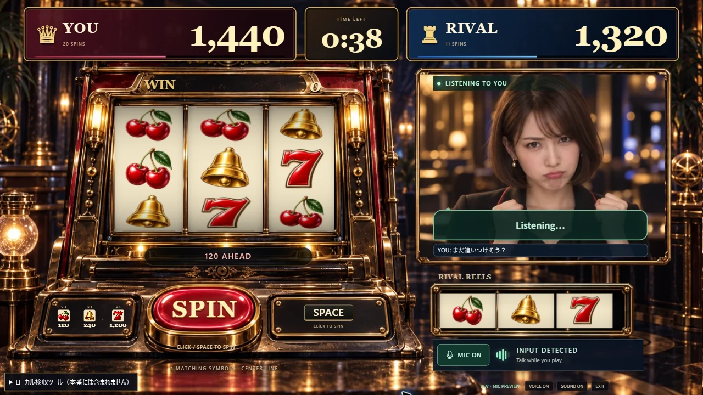
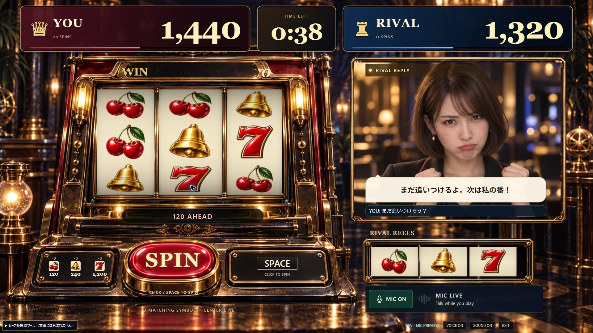
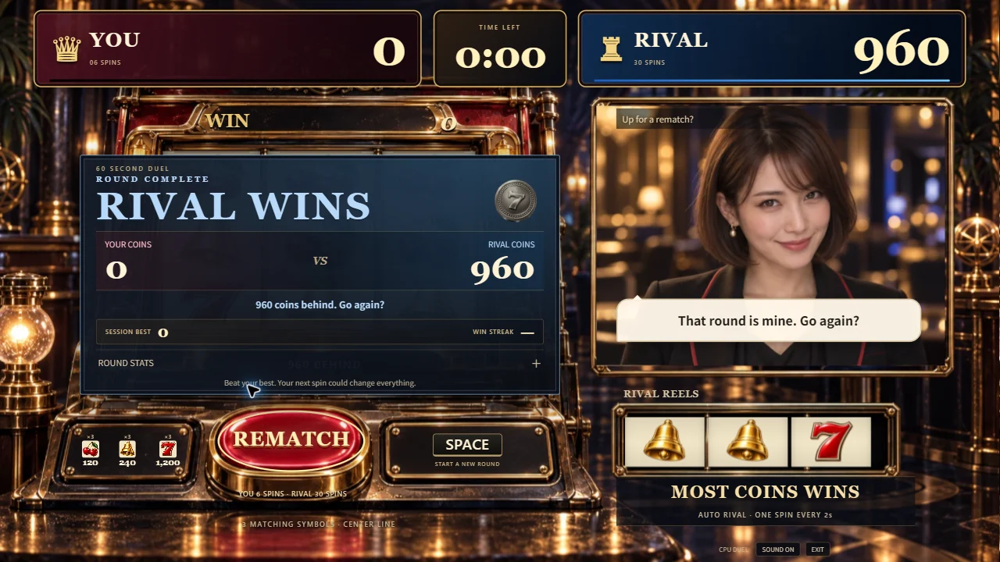

# 会話の割り込みと表示の仕上げ

2026-09-13、Issue #8。相手の音声を途中で止めた後、次の返事の字幕が前の文に続いて表示される経路を修正した。

## 変更

- マイクの発話検出時に、音声のみ・映像付きの両方で `voice_interrupt` をViewModelへ通知する。音声の再生キューを止める処理と、字幕の区切りを同じ通知で開始する。
- 割り込み時に前の字幕の蓄積を消去する。サーバー側で中断した音声を抑制している間は、その音声に付随する字幕も転送しない。
- ライバルの枠に緑色の **LISTENING TO YOU**、返事の字幕が届いたときには金色の **RIVAL REPLY** を表示する。変化がない状態は3秒で通常表示へ戻し、終了・退出・再戦で持ち越さない。
- マイク入力メーター、MIC、VOICE、SOUNDの操作を維持する。ゲームの抽選・回転間隔・得点・描画方法は変更していない。

状態表示は発話検出と字幕の受信に基づく。**RIVAL REPLYは、ユーザーの耳に音が届いたことを測定する表示ではない。**

## 実画面

下の画面はChromeで表示したDEV用の固定例。字幕は架空の文で、API接続・実会話・マイク収録は行っていない。

両サイズで枠内の表示を目視確認。1920×1080では字幕・認識文・状態表示・マイク操作のはみ出しがないこともDOMで確認した。

## 確認範囲

割り込み後の字幕の再連結、音声と字幕の同時抑制、通知の転送、状態の期限・終了処理を対象の既存テストと1件の回帰テストで確認した。型検査・lint・本番ビルドも成功。

過去の実API接続・返答・利用終了の記録は [voice-spike.md](voice-spike.md) を参照。今回の修正後の実マイクでの聞こえ方・会話の体感遅延は、人による追加評価として残る。試合同期の追加検証・商用向け基盤とともに、ゲームソン向けデモの完成条件には含めない。

## 公開確認

PR #105の実装 `5dcdd5e510dca6945e1a23423c6b51b823700fc7` を公開し、Vercel READYを確認。実装CIは [34709592578](https://github.com/yuin15/donburi-g/actions/runs/34709592578) が成功した。公開JS `index-B1FQWJZ3.js` は本番ビルドとSHA-256が一致し、CSSは `index-Cc9CF3BY.css`。

公開ChromeでPLAY NOWから手動6回・0点、独立したライバル30回・960点の60秒対戦を完了し、REMATCHで双方の得点・回転数が0に戻ることを確認した。音声・映像APIは使用していない。

