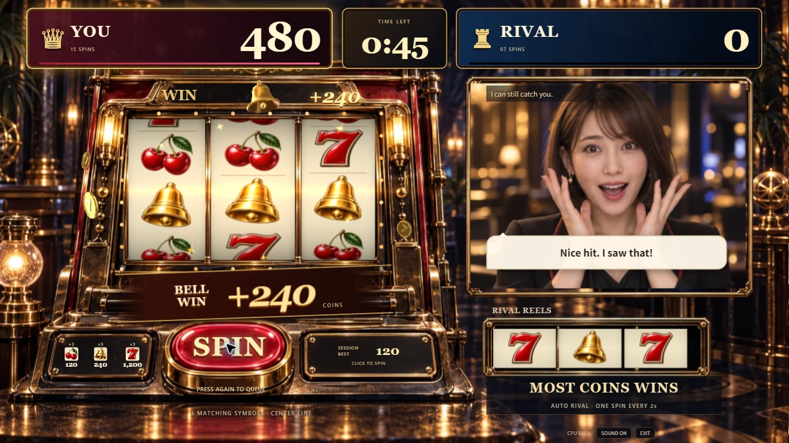

# メンバー向け引き継ぎ

2026-09-13。ゲームソン向けのデモとして実装・公開した範囲と、Issue #115 の現行ルールをまとめる。#115変更の実画面・実機・公開版・Live動作はこの資料では未検証とする。

**[公開ゲーム](https://slot-chan.vercel.app/) · [ソースコード](https://github.com/yuin15/donburi-g) · [配布物](https://github.com/yuin15/donburi-g/releases/tag/demo-2026-09-13)**

## まず遊ぶ

PCで公開ゲームを開き、PLAY NOW → BETを選択 → **SPIN** または Space → 60秒後に勝敗 → REMATCH。両者$100開始で、BET1/3/5はそれぞれ中央1本／横3本／横3本＋斜め2本を判定する。BETは毎回控除し、有効ラインの配当（チェリー$3、ベル$6、7$30）を合算する。回転中の入力は予約せず、残高0では残り時間を観戦する。ライバルは2秒ごとに回る。音声・映像なしでも遊べるが、#115仕様の実画面動作は未検証である。

英語UI、大きな得点、下向きのリール、金貨・立体マーク・BIG WIN、終盤のライトと音、結果・自己ベスト・連勝を実装した。画面内にタイトルは出さず、途中の改造選択も設けていない。

## 声を付ける場合

入口の ADD AI VOICE · OPTIONAL を開き、別経路で共有する招待コードを入力して接続する。映像は必要なときだけ Add live video を選ぶ。マイクを許可し、VOICE READY後にPLAY。

- **MIC**：自分のマイク。入力があるとメーターが光る。
- **VOICE**：ライバルの声。
- **SOUND**：ゲームの効果音。
- **LISTENING TO YOU / RIVAL REPLY**：発話検出／返事の字幕受信を表示する。再生音が聞こえたことを測る表示ではない。

AIは日本語で短く返事する。音声のみはOpenAI、映像付きはLiveAvatarの利用枠も使う。音声・映像の接続失敗時もCPU対戦を選べる。接続後に音声が終了しても試合は続く。試合用WebSocketが切れた場合は退出してCPU対戦を開始する。

## 開発を再開する

Node.js 22以上で `npm ci`、`npm run dev`。CPU対戦は環境変数なしで動く。MVVMを維持し、描画はThree.jsへまとめている。

| 変えたいもの | 開く場所 |
| --- | --- |
| 出目・配当・回転間隔 | `src/domain/game.ts` |
| 試合進行・BET・入力受付・会話状態 | `src/viewmodel/GameViewModel.ts` |
| 筐体・リール・光・金貨 | `src/view/ReelScene.ts` / `CabinetArt.ts` |
| 立体マークの位置・動き・材質 | `src/view/WinSymbols.ts` / `SymbolModels.ts` |
| 画面配置・文字・操作 | `src/view/StageLayout.ts` / `GameView.ts` / `src/style.css` |
| 会話の文脈・割り込み | `server/gptLive.ts` / `matchSession.ts` |

`npm run dev` のURLに `?visual-review` を付けると、当たり・逆転・結果・会話表示を固定例で見直せる。検収ツールは本番へ含まれない。ライブのローカル起動とVercel公開は [運用手順](operations.md)、細かい責務は [MVVM構成](architecture.md) を参照。

## Houdiniモデル

コイン・ベル・チェリーの3種類をHoudini Apprenticeで制作し、ゲームへ組み込んだ。3つのOBJは約566KB。Three.jsで形状と反射マップを共有する。

配布ZIPにはOBJ、編集用の `.hipnc` 2点、再生成用Python、材質コード、プレビュー、参考画像、8秒の無音動画が入る。Gitのソースからも [制作手順](../art-source/houdini/README.md) に沿って再生成できる。通常のゲーム開発にHoudiniの導入は不要。

Apprenticeで制作した素材はゲームソンの非商用デモ向けとして扱う。

## 完成した範囲と追加評価

CPUの60秒対戦・独立回転・連打・当たり・勝敗・再戦、公開反映、3Dモデルの編集元、READMEと引き継ぎ資料を揃えた。実APIの音声・映像接続と終了、短い合成質問への返答は過去に確認し、[記録](voice-spike.md)を残している。[今回の字幕・会話表示](conversation-feedback.md)は、固定例の実画面と回帰テストで確認した。

**修正版の実マイクによる会話・割り込みの聞こえ方、初見プレイ、実Edgeは未評価。** 未評価を合格扱いにはしない。これらはメンバーが次に試すとよい追加評価であり、今回のデモの公開条件には含めない。

スマートフォン、PvP、途中の改造、追加の試合同期検証、商用向け共有DB・全体課金上限は今回の範囲外。現在の方針は [AGENTS.md](../AGENTS.md) を優先する。

キー・招待コード・個人メール・実会話・マイク録音をGitや配布ZIPへ入れない。秘密値はVercelのSecret等で管理し、別経路で引き継ぐ。
