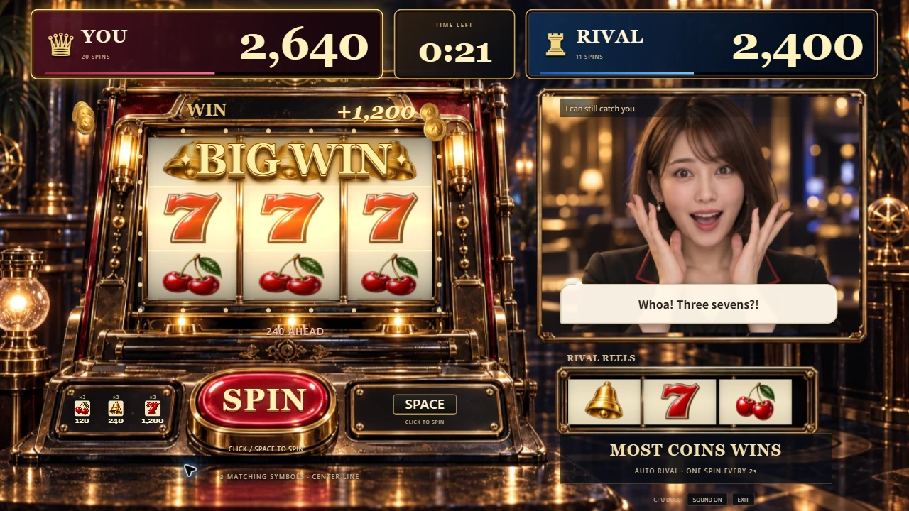
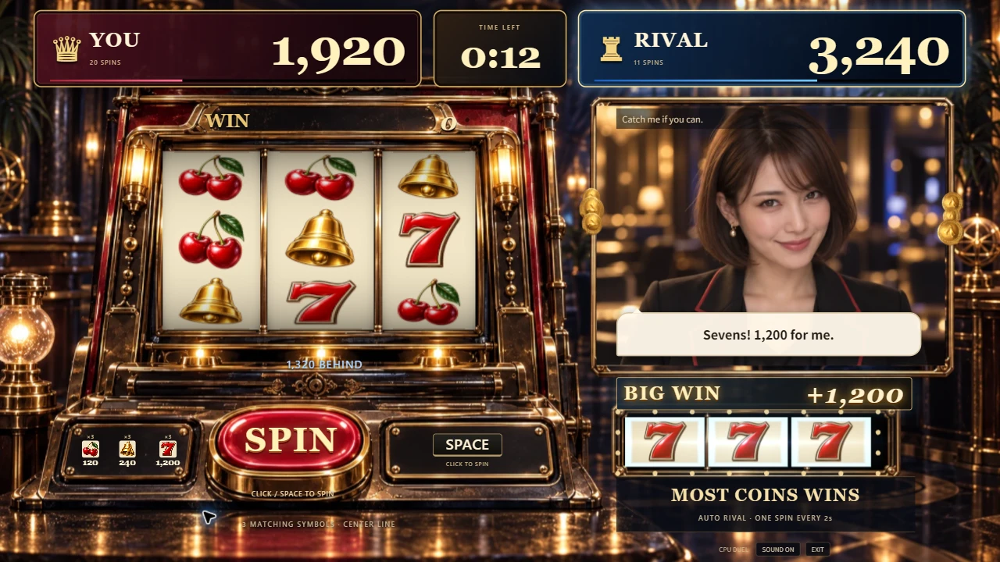
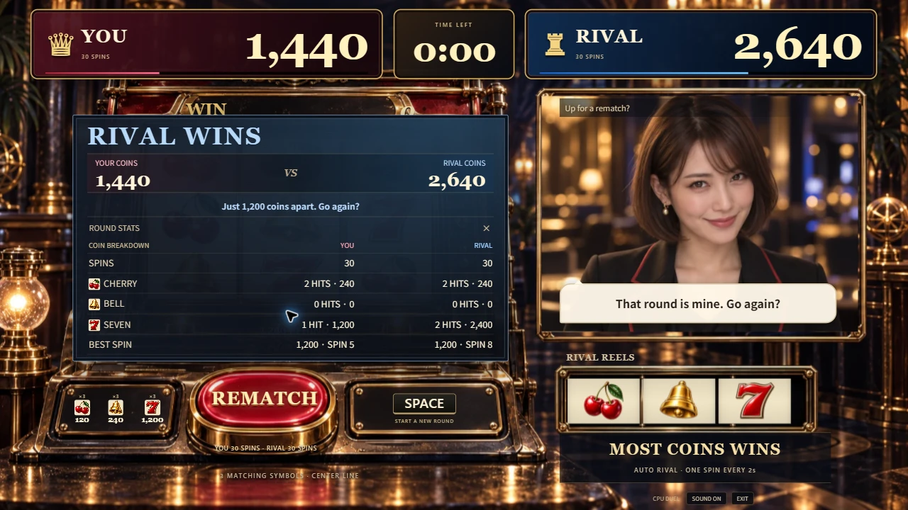

# 英語UIと左右別の当たり演出

2026-09-12。#81。承認済みの通常当たり・プレイヤーBIG WIN・ライバルBIG WINの3案を基に、既存のThree.js画面を改善した。

## 画面の変更

- 画面内のタイトルを非表示にし、YOU / RIVALの得点を同じ大きさで拡大。中央にMM:SSの残り時間を置いた。
- 操作・配当・結果・CPUの短い反応を英語に統一。SPIN、SPACE、WIN、BIG WIN、REMATCHを中心にする。
- 通常当たりはWIN欄、中央の当たり線、少数のコイン。7揃いは金色の立体文字、電球、12枚のコインで強調する。
- ライバルの当たりは小リール・右側WIN欄・右側得点を強調。コインは顔と当たり線の外側を通り、当たった側の得点へ向かう。
- 停止待ちの相手がいる間は逆転を確定しない。両者が止まった時点で点差を判定し、一時的な首位交代を大きな逆転表示にしない。BIG WINは7揃いの表示であり、逆転の意味を持たせない。
- 60秒、配当120/240/1200、プレイヤーの手動回転、相手の2秒ごとの自動回転は維持する。

## 実Chromeでの見栄え

DEV専用の固定出目を表示して1280×720と1920×1080で比較した。以下は画面検収用の固定場面であり、実際の抽選履歴ではない。最初の表示で相手の7が白く飛んだため、リール内側の青い加算と発光を弱めた。BIG WINの位置、文字サイズ、コインの軌道も実画面を見て調整した。

| 場面 | 1280×720 | 1920×1080 |
| --- | --- | --- |
| 通常当たり | [画面](evidence/english-wins/normal-1280.webp) | [画面](evidence/english-wins/normal-1920.webp) |
| プレイヤーのBIG WIN | [画面](evidence/english-wins/player-big-1280.webp) | [画面](evidence/english-wins/player-big-1920.webp) |
| ライバルのBIG WIN | [画面](evidence/english-wins/rival-big-1280.webp) | [画面](evidence/english-wins/rival-big-1920.webp) |

1280×720の結果画面で内訳を開き、左右の得点・表・REMATCHボタンが重ならないことを確認した。

## 描画と確認範囲

1つのThree.js rendererと既存4点のWebPを共有する。コインは左右12枚ずつの再利用プール、電球は左右それぞれInstancedMesh。追加の画像要求はない。動きを減らす設定ではコインを抑制し、停止中は連続描画を行わない。

初回の並行操作中の計測は88標本、中央値33.3ms、p95 466.7msと不安定だった。原因を断定せず、Chromeを前面にして他の操作を止めた状態で再計測したところ、407標本、中央値16.7ms、p95 16.9ms、最大23描画・2,470三角形だった。[計測値](evidence/english-wins/motion-metrics.json)。静止5秒の追加描画は0フレーム。[静止計測](evidence/english-wins/idle-metrics.json)。これはこのPCでの観測であり、端末全体の性能保証ではない。

型検査・lint・217テスト・本番ビルド成功。既存テストへ、片側が先に停止しても逆転を誤判定しない例と、相手側コインが顔を横切らず上の得点へ進む例を追加した。主JSは139.48KB gzip、CSSは4.75KB gzip。既存の500KBチャンク警告は継続する。

公開版の通しプレイはデプロイ後に記録する。実API・実マイク・実Edge・初見の人の評価は今回のローカル画面確認には含まれない。
