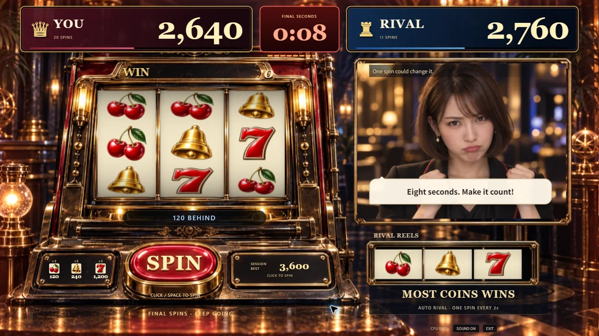
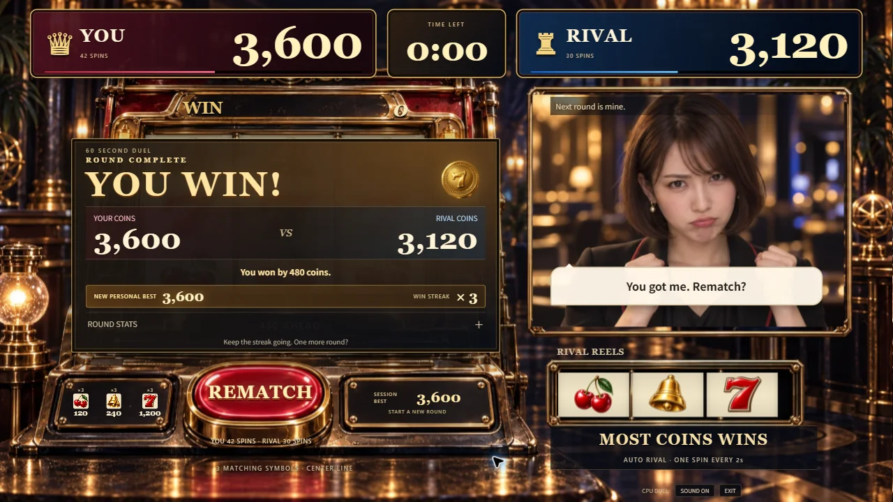

# 最後の10秒と再戦の目標

2026-09-12、#96 / PR #97。ゲームソンのデモとして、終盤の緊張感ともう一度回したくなる流れを改善した。

- 残り10秒になると時計下のライトが1秒ごとに減り、画面の端が温かい赤に光る。時計は数字が変わる瞬間に動き、最後の5秒には短いカウント音が鳴る。Three.jsの共有描画内で表現し、動きを減らす設定も尊重する。
- 結果にはこのタブでの自己ベストと連勝数を表示。自己ベスト更新時は金色で強調する。次の試合中も筐体に目標を表示する。
- 記録はViewModelのメモリ内だけに保持し、ページの再読み込みでリセットする。アカウント、DB、個人情報、通信は追加しない。
- 配当・抽選・手動回転・ライバルの独立回転は従来どおり。成績表示は確定した試合結果から作る。

以下はChromeの実画面で確認したDEVプレビュー。指定した成績を使う演出見本で、実プレイの記録ではない。

ローカルの実CPU対戦では、Space入力で獲得した自己ベスト240が再戦中と次の結果にも保持された。次の試合は手動6回・0点対ライバル30回・120点で終了し、自己ベスト240と連勝なしを表示した。1280×720 / 1920×1080で結果・詳細とREMATCHボタンの余白を確認した。

既存の描画・音声・ViewModelの27テスト、型検査、lint、ビルド、実装CIが成功。新しいテストは追加していない。主JSは142.97KB gzip、CSSは6.05KB gzip。秘密情報・メールアドレスの混入チェックも通過した。

実装CI: https://github.com/yuin15/donburi-g/actions/runs/34698527606 。
公開版 https://slot-chan.vercel.app/ に反映し、READY と公開JS `index-CVA3pq4y.js` / CSS `index-DkOVTpg4.css` の一致を確認した。
