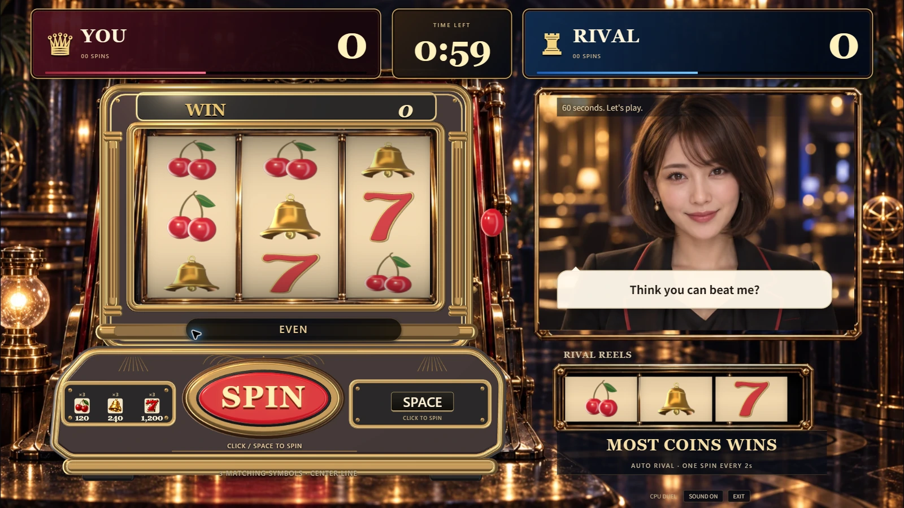
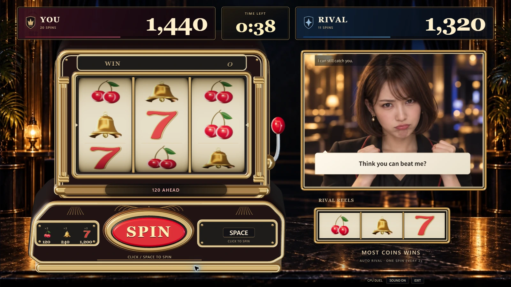
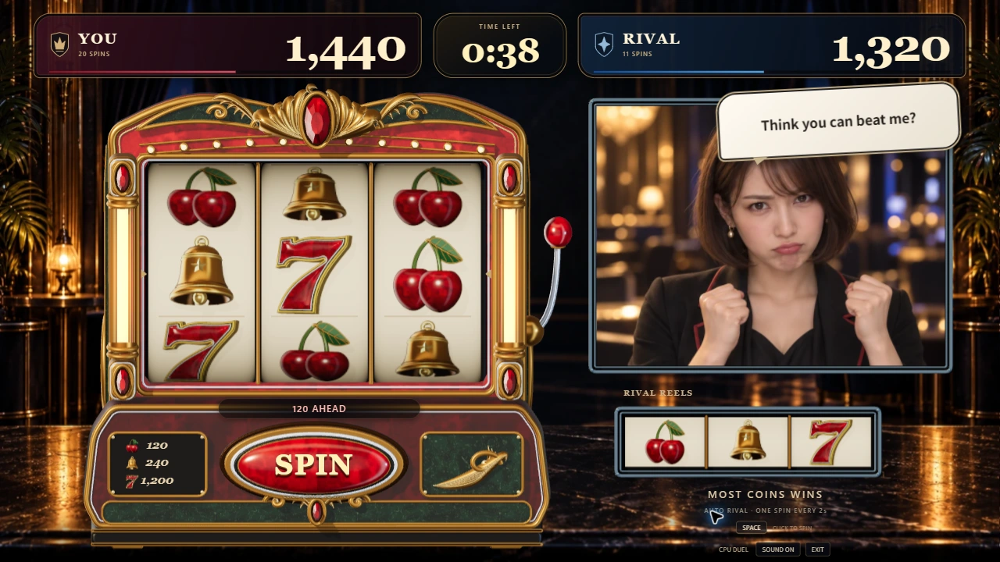
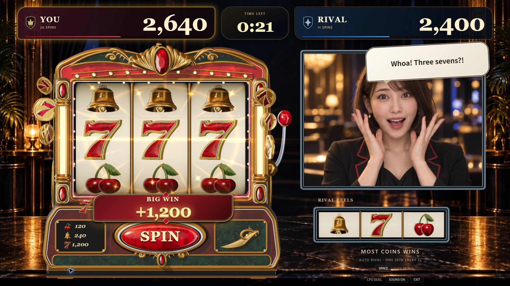
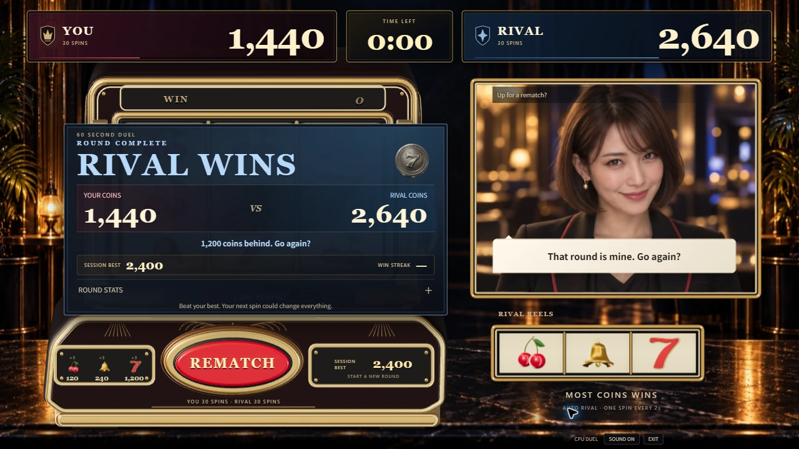

# ゲーム画面全体の質感と配置の改善

2026-09-13 / #109。公開ゲームを見直したところ、背景写真の旧筐体が新しい3D筐体の周りに残り、照明・絵柄・操作部も揃っていなかった。モデル単体のプレビューを完成度の判断に使いすぎていたため、今回は実際の対戦画面を基準に調整した。

## 変更前と変更後

変更前は公開CPU対戦、変更後はローカルの固定局面プレビュー。勝ち演出で隠れる前の通常画面でも、背景・筐体・リール・操作部が一体に見えることを重視した。

- 旧筐体や額縁を含まない[新しい背景](visual-assets.md#casino-room)を制作し、3D筐体の二重写りを解消した。
- 過剰な環境光を減らし、暖色の主光源・寒色の補助光・色調変換を揃えた。塗装を深い赤へ調整し、金属との明暗差を付けた。
- ゲーム用の筐体表示にY/Z方向の投影補正を入れ、上部・肩・操作盤の厚みを見せた。制作元のOBJ形状や回して見るモデルプレビューは変えていない。
- リール3列の幅を揃え、凹んだリール窓、金属の仕切り、中央ラインの目印、ライバル側の枠をThree.jsの形状で追加した。
- リール端の陰影とアイボリー色を調整。ゲーム中の配当アイコンにも同じ3Dモデルを使った。入口・結果の小さなアイコンは従来の画像を残す。
- 大きい得点を保ちながら上部の余白を広げ、ボタン位置、字幕、補助説明を整理した。

これは固定視点のゲーム画面の改善で、参考画像の写実的な仕上がりを再現しきったという評価ではない。今後の改善もモデル一覧ではなく、実際の通常プレイ・当たり・結果を見て判断する。

## PC画面での確認

上記3枚は固定局面プレビュー。小さいPC画面でのリールの比率、得点、結果と再戦ボタンの収まりを目視した。大当たりは画面上で確認するため固定しており、通常抽選で連続して引いたという記録ではない。

Chromeの1920×1080・前面タブで8秒の回転/当たりを計測し、フレーム時間の中央値16.7ms、95パーセンタイル17.0ms。最大42 draw calls / 102,328 triangles。[計測値](evidence/game-art-direction/performance.json)。待機5秒の追加描画は0フレームだった。[待機計測](evidence/game-art-direction/idle.json)。特定PCの短時間計測であり、全PCでの性能保証ではない。

既存の235テスト、型検査、本番ビルド、lint、Node ESMのサーバー起動確認が成功。テストは追加していない。主JSは801.79KB gzip、CSSは6.78KB gzip。3Dモデルを含む主JSの既存サイズ警告は残る。

音声・映像APIは今回の画面確認に使っていない。CPU対戦の規則・MVVM・任意ライブの接続処理は変更していない。
