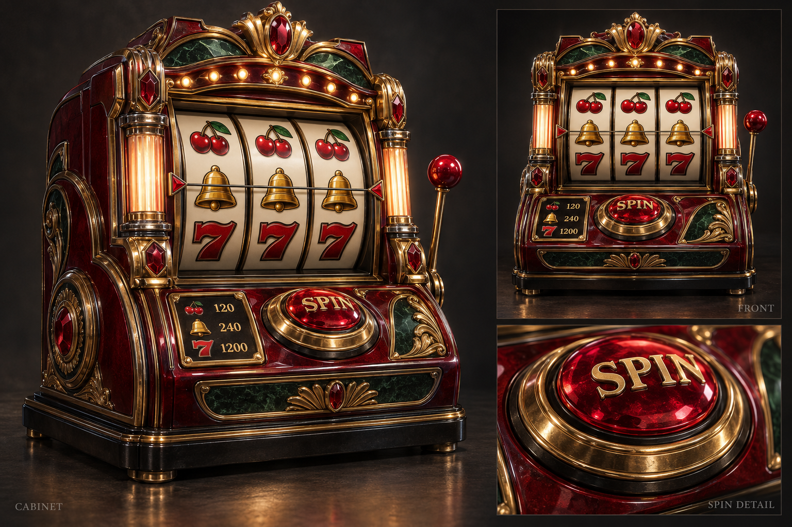
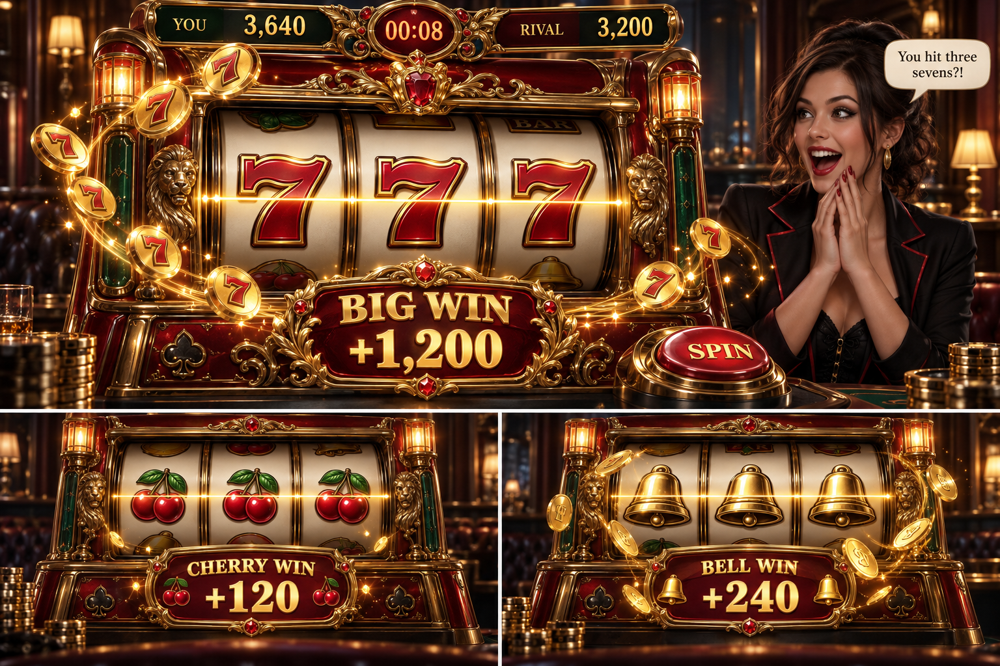
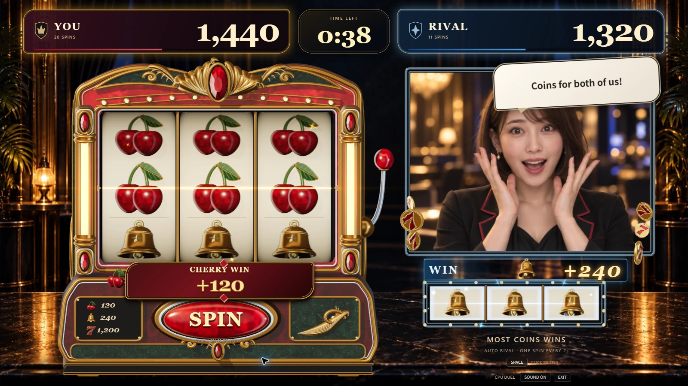
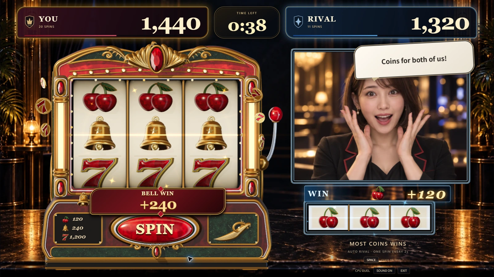
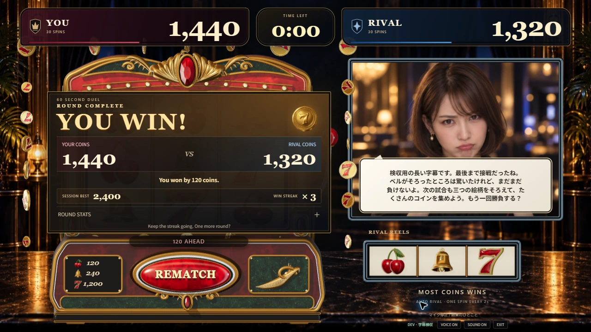
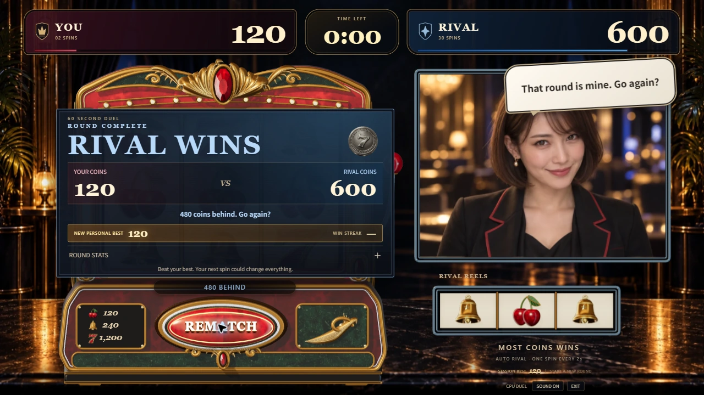
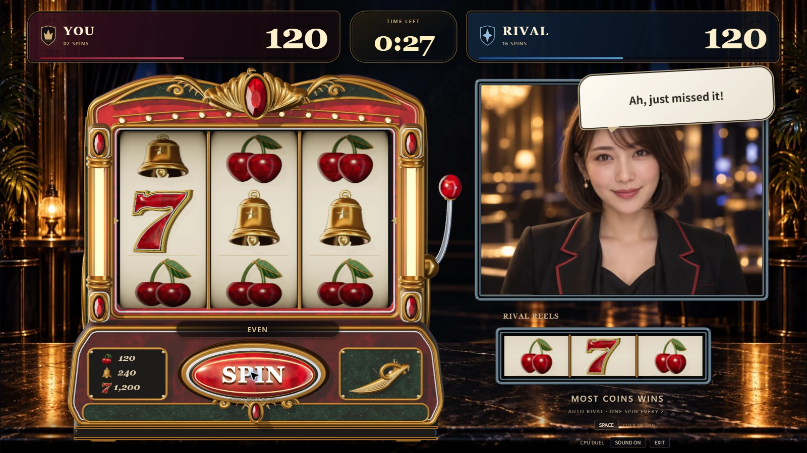
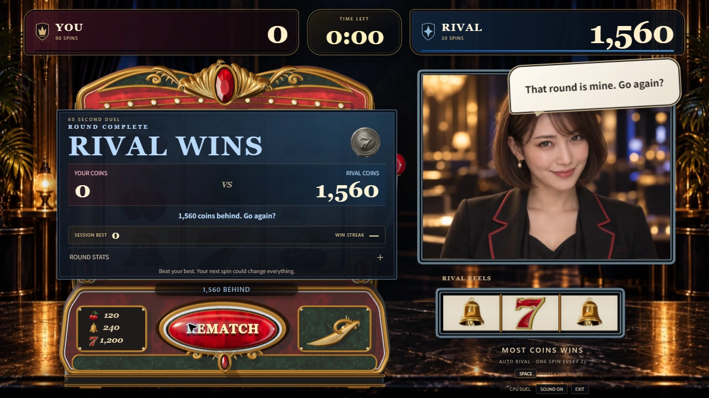

# 採用リファレンスからの3Dモデル・ゲーム画面の改善

2026-09-13 / Issue #109 / PR #110。

ユーザーが採用した[3枚の制作目標](art-reference/README.md)を基準に、Houdiniの造形、Three.jsの材質・照明、実際のゲーム画面を修正した。筐体の形は2枚目、当たりの強弱は3枚目を基準にする。生成画像は正確な三面図ではなく、描かれたBARは追加しない。

## リファレンスと実ゲーム

| 採用した筐体の目標 | 実ゲーム・通常画面 |
| --- | --- |
|  |  |

| 採用した演出の目標 | 実ゲーム・7揃い |
| --- | --- |
|  |  |

ゲーム画像は開発用の固定局面。配当の大小を同じ条件で比較するために使用したもので、通常抽選で連続して当たったという記録ではない。

## 作り直した部分

- **7**：太く波打つ旗と曲がった脚、金の側面、細い銀の縁、暗い溝、膨らんだ赤いエナメル面を形状で制作。内側の鋭い切り欠きは丸いオフセットで処理し、赤い面が欠ける問題を修正した。
- **チェリー**：左右非対称の実、くぼんだ茎元、張った肩、太い曲線の茎、折れた緑の葉、金属の葉脈・縁・茎元の輪を制作。変形後の形から法線を求める。
- **ベル**：厚い裾、暗い空洞、見える舌、丸い肩、二重の帯、前面の立体の星を制作。
- **コイン**：同じ7を両面に配置し、赤い面・二重の縁・側面の刻み・放射状の装飾・粒状の縁を追加。24枚で同じ形状を共有する。
- **筐体**：曲線の上部アーチ、大きいルビー、厚みのある金の葉と渦巻き、緑の石材、照明柱、赤い塗装、張り出す操作盤、ドーム状のSPINボタンを制作。広すぎる黒い屋根の投影も縮めた。
- **材質**：塗装の細かな模様、緑の石材と筋、加工目をコードで生成。完成した筐体の写真をモデルへ貼る方式は使わない。暖色の主光源・寒色の補助光・静的な影を揃える。
- **ゲーム画面**：リール窓を縦に拡大し、3列とライバルの絵柄の比率を維持。配当表を縦に整理し、ボタンと説明を配置し直した。短い台詞と長い字幕の表示を分け、得点・時間・顔・SPINを残す。

## 当たりの強弱

| 当たり | 見せ方 |
| --- | --- |
| チェリー / +120 | 中央の細い金線、5つのきらめき。コイン噴出なし |
| ベル / +240 | 中央ライン、金の輪、10個のきらめき、6枚のコイン |
| 7 / +1,200 | 大きい獲得表示、周囲のライトと光線、18個のきらめき、12枚のコイン |

コインは中央の絵柄や相手の顔を横切らず、筐体の外側から得点側へ弧を描く。光の広がりは赤い絵柄が白く飛ばない強さへ調整した。動きを減らす設定ではコインを止める。

## 確認

1280×720、1600×900、1920×1080の実Chromeで通常・チェリー・ベル・7揃い・結果を比較した。結果下の自己ベストを1行へ収め、Liveでは同じ位置を接続・マイク操作へ使う。長い字幕は顔の下側に置き、目と得点を残す。

1920×1080の前面表示で回転と当たりを約8秒計測し、409サンプルのフレーム間隔は中央値16.7ms、95パーセンタイル16.9ms。ピーク56描画呼び出し・385,285三角形。静止5秒の追加描画は0回だった。このPCでの短い計測であり、他のPCの速度は保証しない。[回転計測](evidence/game-art-direction/performance.json)、[待機計測](evidence/game-art-direction/idle.json)。

本番ビルドの主JSは1,964.56KB gzip、CSSは7.52KB gzip。型検査・lint・既存235テスト・サーバーの実行形式の確認・ビルドが成功。詳細なOBJをそのまま含めるため初回の転送量は増えた。[公開反映の記録](current-status.md#公開記録)。

塗装と石材の模様は共通の計算から一度だけ生成し、CPU上の画素だけを再利用する。個々のThree.jsテクスチャは独立して破棄できる。修正前後の全画素が同一であることを照合し、このPCの単体計測では3枚の生成が330msから81msへ短縮した。CIの初期化時間切れも、テストの制限を緩めずに解消した。

最終ビルドの実CPU対戦では、無操作時に自分0回対相手19回を確認した後、クリックとSpaceの予約で自分2回・120点、相手30回・600点で60秒を完走した。別の通し対戦では2回・0点対30回・480点で終了し、再戦時の60秒・両者0回/0点への初期化、Space予約、退出も確認した。

既存の自動テストのうち、今回変えたチェリーとベルのコイン枚数の期待値だけを更新した。ゲーム規則・MVVM・任意Liveの接続処理は変更していない。今回の表示確認では音声・映像APIを呼ばない。長い日本語字幕も実際の会話ではない開発用の文で確認した。

## 公開の実画面

PR #110をマージし、https://slot-chan.vercel.app/ へ反映した。Vercelで5つのOBJを元の精度のまま復元し、モデルと公開JSの一致を検査。[公開したコミット・CI・配信ファイルの記録](current-status.md#公開記録)。以下は固定局面ではなく公開サイトでの通常のCPU対戦。

## 参考画像との差として残すこと

実装はPCの固定視点向けのリアルタイム描画で、生成画像と同じ写実性を達成したという評価ではない。彫刻は再現可能な曲面と葉・渦巻きへ整理し、画像内の微細な傷・装飾をすべて再現するものではない。リールの絵柄は元の3Dモデルを起動時に一度描画して共有し、回転中の負荷を抑える。大きな筐体・当たりのコイン・配当マークは3Dモデルを描画する。この資料はPR #110時点の記録。PR #113で当たりの3絵柄、獲得数字、操作・結果見出しを立体化し、得点・会話・詳細情報はDOMで維持した。[後続の実装と実画面](physical-win-presentation.md)。
