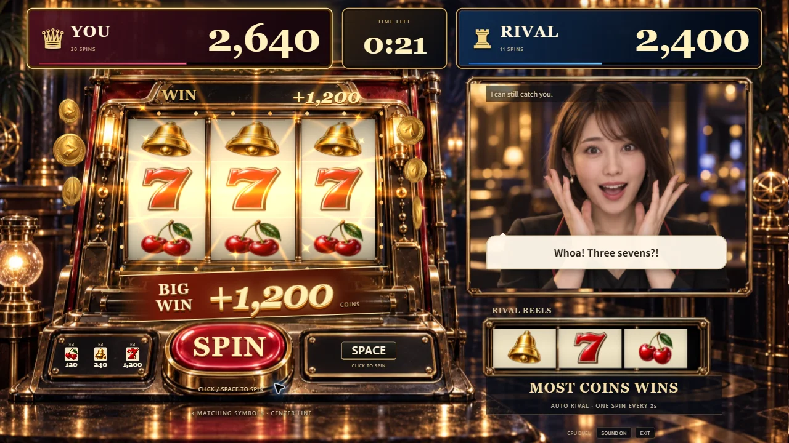
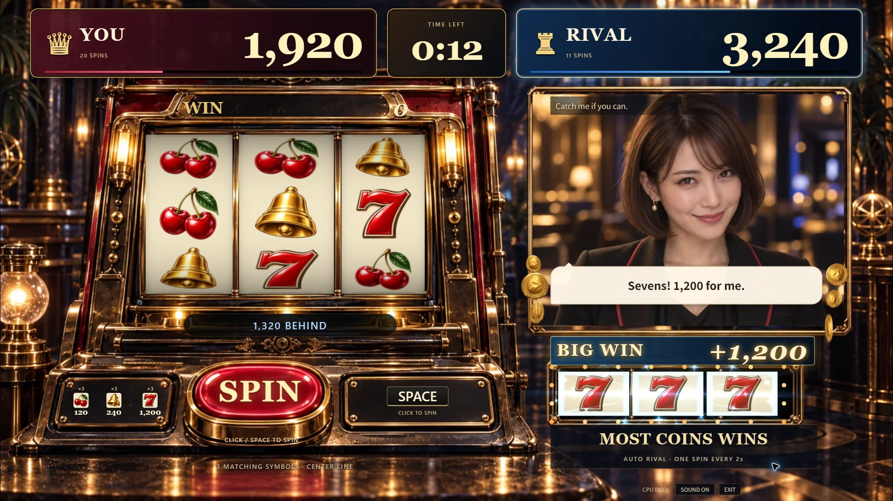

# ゲームソン向けデモの演出

2026-09-12、#94 / PR #95。**見栄えと回す面白さを最優先する。** 多少のバグは許容し、追加の試合同期検証や商用向け基盤の整備をデモの完成条件にしない。この方針は [AGENTS.md](../AGENTS.md) にも記録した。同期の #7 は追加検証を合格扱いにせず、対象外としてクローズした。

## 画面で変えたこと

- 獲得コインをリール下に大きく表示。小当たりは控えめな札、ジャックポットは赤と金の BIG WIN にして、3段の絵柄を読みやすくした。
- Three.js の金貨を大きく広げ、光の筋、きらめき、流れる電球を追加。ライバル側は青を基調とし、顔を隠しすぎない範囲に収めた。
- 当たりで得点が跳ね、ライバルの表情が変わる瞬間には小さく寄る。既存の4表情アトラスを使い、顔の縦横比は変えない。
- 回転開始はボタンの低音とラチェット音、各リール停止は個別の機械音。通常当たりは短いチャイム、ジャックポットは上昇するファンファーレとコイン音にした。音源はコードから合成する。

以下はローカルの演出プレビューを実際に Chrome で表示したもの。検証用に指定した絵柄で、実プレイの抽選結果を装ったものではない。

## 確認した範囲

PC Chrome で通常当たり、ジャックポット、ライバル側の当たり、実際の60秒CPU対戦とSpaceの予約入力を確認した。1つのThree.js描画と4枚の共有テクスチャを維持し、8秒の回転・当たりプレビューはフレーム時間の中央値16.7ms、95パーセンタイル16.8msだった。録画中の1回の測定であり、すべてのPCでの性能保証ではない。

既存の描画・効果音19テスト、型検査、lint、本番ビルド、PR CIを確認。今回のためにテストは追加していない。主JSは141.97KB gzip、CSSは5.77KB gzip。秘密値・メールアドレスの混入チェックも通過した。

公開版 https://slot-chan.vercel.app/ へ反映し、READY と公開JS `index-CtdUnf6D.js` / CSS `index-V1iSba7e.css` の一致、PLAY NOWからの開始と手動回転を確認した。実装CI: https://github.com/yuin15/donburi-g/actions/runs/34697547485 （成功）。

音声会話の聞きやすさや割り込みの実機評価は別途残る。任意の追加機能として扱い、無料CPUデモの公開を止める条件にはしない。
