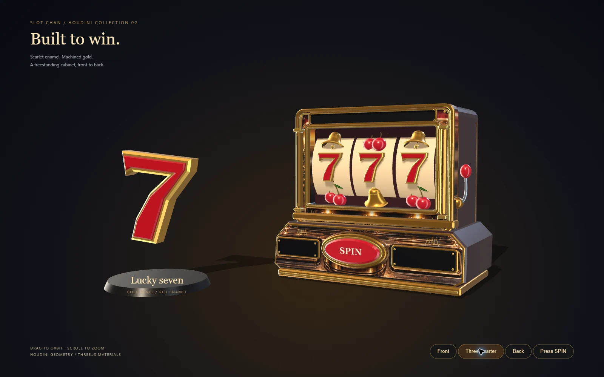
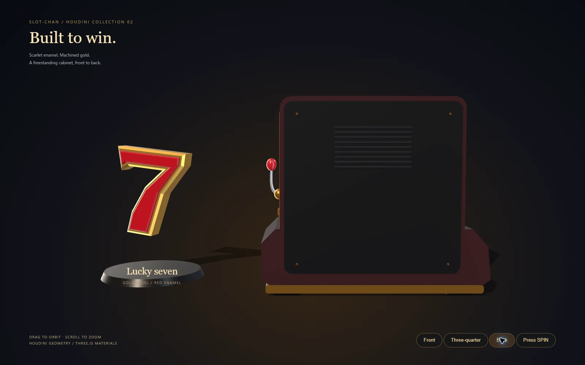
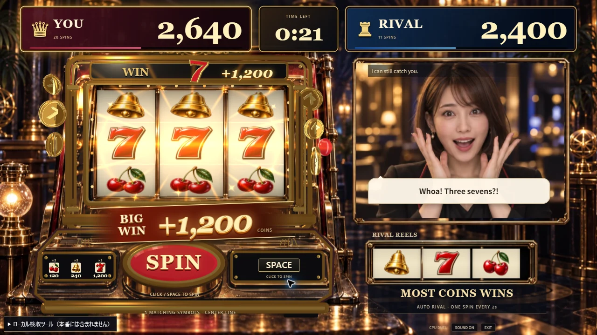
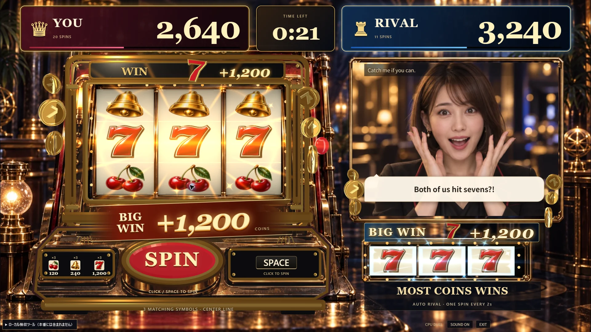
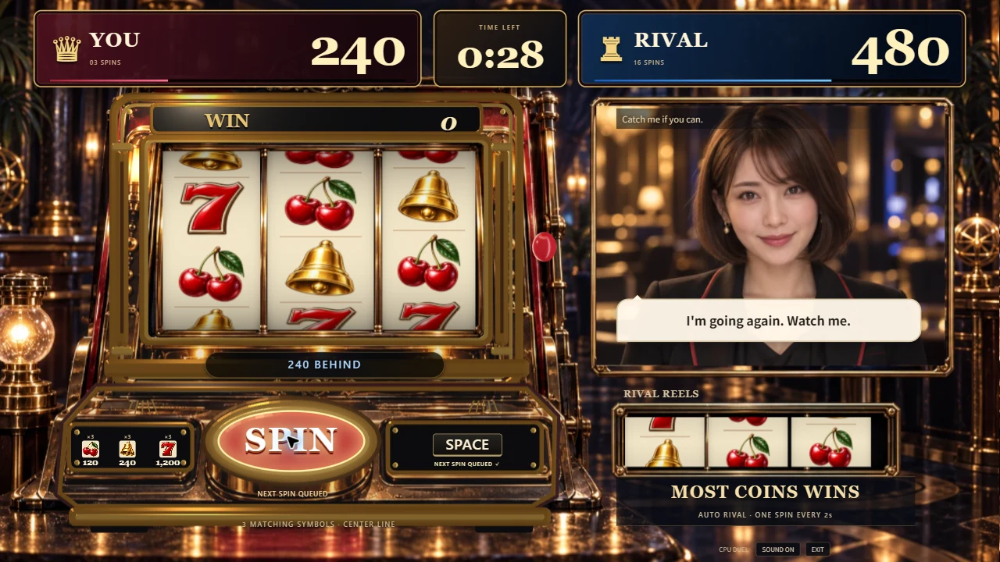

# Houdini製の7と筐体

2026-09-13、Issue #106。赤い立体の7と、側板・背板まで持つ金色の筐体を追加した。**今回の依頼はPRまで。公開デモにはまだ反映していない。**

## 制作したもの

| モデル | 形状 | 三角形数 | OBJ容量 |
| --- | --- | ---: | ---: |
| 7 | 面取りした金色の本体、赤いエナメルの内側、側面と裏面 | 124 | 4,824 bytes |
| 筐体 | 多層の窓枠、縦の金属柱、側板、背面カバーと通気口、操作盤、赤いボタン、レバー、台座と脚、無地ドラム | 8,840 | 407,244 bytes |

Houdini Apprentice 22.0.429のPython SOPで制作し、Divide SOPで三角形化してOBJを書き出した。7の凹んだ輪郭は明示的に三角形化し、正面の法線が反転しないようにした。完成したOBJの有限座標・三角形・法線の向きを確認済み。

[`build_cabinet.py`](../art-source/houdini/build_cabinet.py)が制作元。再生成すると、2つの編集用ノードを含む`.art-build/slot-chan-cabinet.hipnc`も作られる。保存したシーンを新しいHoudiniプロセスで開き、124 / 8,840三角形を再生成できることを確認した。ネイティブシーンはGit対象外で、制作スクリプトとOBJをGitで管理する。[再生成・部位・座標の手順](../art-source/houdini/README.md#7と筐体)。

## ゲームへの組み込み

- `CabinetModel.ts`が筐体を読み込み、同じ材質の形状をまとめて描画する。ゲームのThree.js描画は1つのまま。
- 金属の縁、赤いボタン、漆調の側板、黒いパネルを分ける。既存のコインと同じ反射マップを共有する。
- 受理されたプレイヤーの回転に合わせて、赤いSPINボタンを180msで押し込む。動きを減らす設定では静止させる。
- `SymbolModels.ts`と`WinSymbols.ts`で、1,200コインの7揃いに赤い7を表示する。両者の得点表示のそばへ配置し、形状を共有する。
- 回転中のリールは既存の下向きアニメーションと共有絵柄画像を使う。筐体OBJに含む無地のドラムはゲームでは省き、制作プレビューで使用する。
- 正面の装飾パネルには既存の`casino-stage.webp`の対応部分を貼る。枠・側面・レバー・ボタン・背面は3D形状で、写真から全面の立体形状を復元したものではない。

配当・60秒の対戦・MVVM・クリック/Spaceと1回の予約・相手の独立回転は変更していない。音声・映像のAPIも今回の制作と確認では使用していない。

## 画面での確認

開発サーバーの`/art-source/houdini/cabinet.html`で、ドラッグ・ホイール・**Front / Three-quarter / Back**を使って形状を見られる。**Press SPIN**で文字を含むボタンが押し込まれる。このページは本番ビルドに含めない。

背面も確認し、ドラムが背板からはみ出ない奥行きへ調整した。

PCの1280×720と1920×1080で、窓枠・得点・ボタン・7のWIN表示が重ならないことを確認した。以下の当たり画面は、再現用のDEVプレビュー。実際の抽選結果とは分けている。

通常CPU対戦は本番ビルドをローカルChromeで実行した。最初の無操作中も相手だけが回転し、その後クリック・Spaceで4回転（240点）、相手30回転（3,000点）で60秒を完走した。結果表示、REMATCHで0点・0回・60秒への初期化、再戦でのSpaceとEXITも確認した。

## 検証と負荷

- 型検査、lint、既存235テスト、本番ビルド、Node ESMのAPI起動確認が成功。演出用の追加テストは作っていない。
- 1920×1080、録画なしの既存DEV計測（回転と当たりの8秒）: 406サンプル、中央値16.7ms、p95 16.9ms、最大33 draw calls / 46,630三角形。このPCのChromeでの1回の結果で、全PCの性能保証ではない。
- 静止した通常局面の5秒間は追加描画0フレーム。動きを減らす設定でも、両者の7と獲得表示が欠けないことを実画面で確認した。
- 主JSは386.12KB gzip、CSSは6.22KB gzip。OBJを読み込むため主JSの転送量は従来から約101KB増えた。Viteの既存の大きいチャンク警告は残る。
- APIキー・環境ファイル・招待コード・メールアドレス・実会話は追加ファイルへ含めない。証拠画像はCPUと固定プレビューのみ。

Apprenticeで制作したモデルは、既存のコイン・ベル・チェリーと同じくゲームソンの非商用デモ向けとして扱う。[制作元と利用条件](../art-source/houdini/README.md)。
