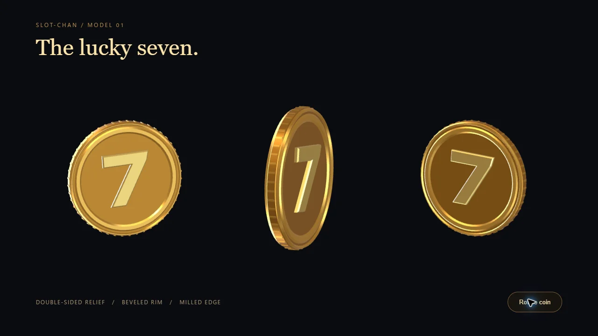
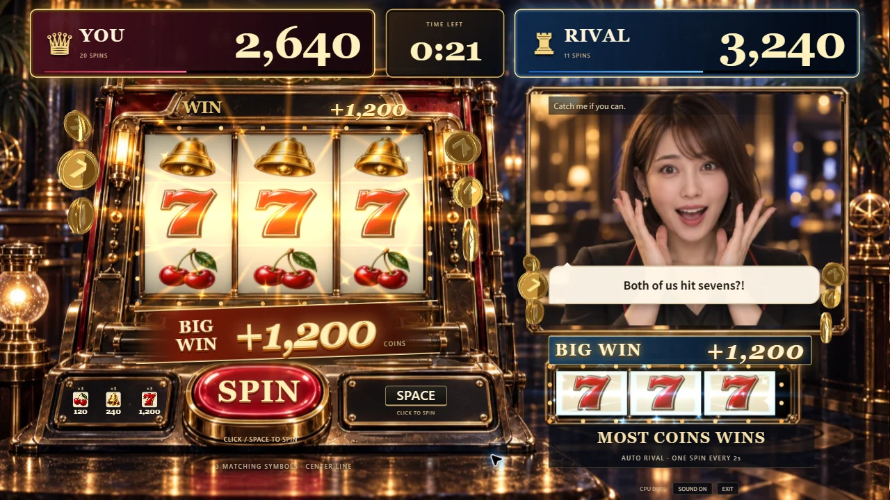

# Houdini製の立体コイン

2026-09-13、Issue #99。当たりのコインを平面画像から立体モデルへ変更しました。厚みのある本体、二重の縁、刻んだ側面、面取りした両面の7をHoudini Apprentice 22.0.429で生成し、OBJへ書き出しています。

上のゲーム画面はDEVの演出確認用状態です。抽選結果や試合の記録ではありません。

## 変更したもの

- 形状は2,956三角形。24枚のコインで同じ形状と小さな反射マップを共有します。
- 回転に合わせて、表・裏・側面と金属の反射が変わります。左右の当たりを独立して表示し、得点・中央リール・ライバルの顔を覆わない既存の経路を維持します。
- モデルは起動時に読み込みます。当たり中に追加のモデル通信や形状生成はありません。描画は既存のThree.jsの1画面に統合しています。
- 制作スクリプト、書き出したOBJ、ゲームと同じ材質の拡大プレビューを追加しました。[編集・再生成手順](../art-source/houdini/README.md)。

## 確認した範囲

- Houdiniの実行環境でApprenticeライセンスを確認し、制作スクリプトの実行・OBJ・編集用シーンの保存に成功しました。Houdiniの面順とOBJの法線が一致するよう修正し、7の面は書き出し前に三角形化しています。
- ローカルChrome、1280×720で、通常の回転、小当たり、7揃い、両者の当たりを確認しました。8秒の演出録画中のフレーム間隔は中央値16.7ms、95パーセンタイル16.8ms。最大24描画呼び出し・37,954三角形でした。これはこのPCでの1回の測定です。
- 待機5秒の追加描画は0フレーム。`prefers-reduced-motion: reduce`ではコインときらめきが消え、得点と当たり表示を残します。
- 通常CPU対戦を60秒進め、無操作のプレイヤー0回・0点に対し、ライバル30回・480点で結果が出ることを確認しました。
- 型検査、lint、既存234テスト、Node ESMサーバー起動確認、本番ビルドが成功しました。主JSは211.23KB gzip、CSSは6.05KB gzipです。
- 音声・映像APIはこの変更の確認に使用していません。実マイクの会話評価は引き続きIssue #8です。

## 制作条件

Houdini Apprenticeで制作したモデルなので、ゲームソンの非商用デモ向けとして扱います。商用化する場合は制作ライセンスと素材の利用条件を確認してください。ライセンス・アカウント情報、メールアドレス、編集環境の情報を含む可能性があるネイティブシーンはGitへ含めません。
