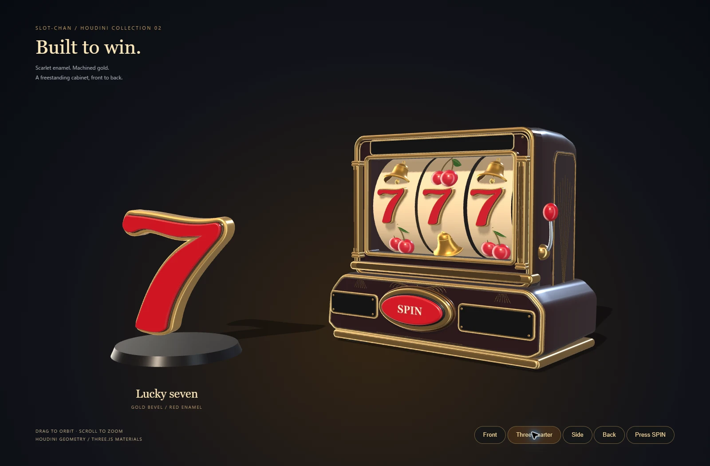
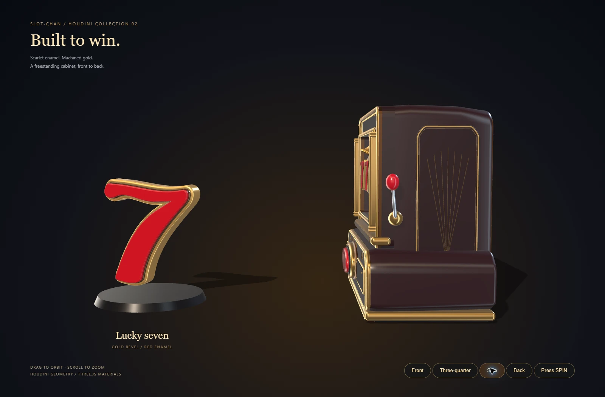
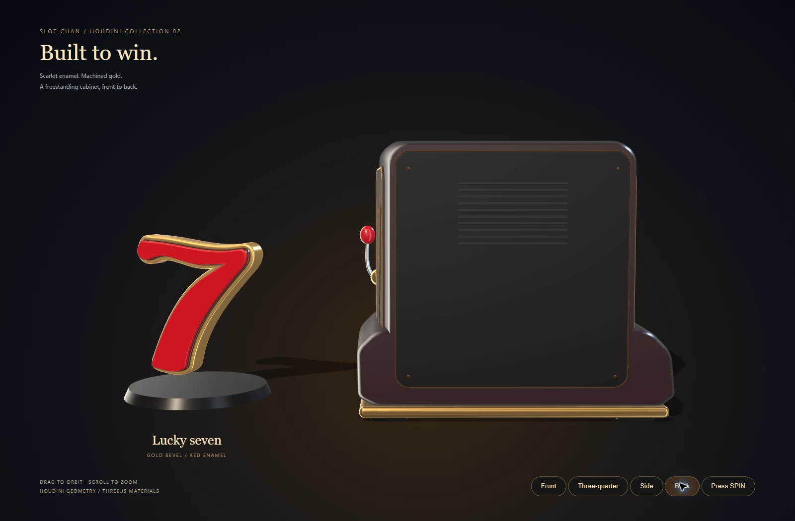
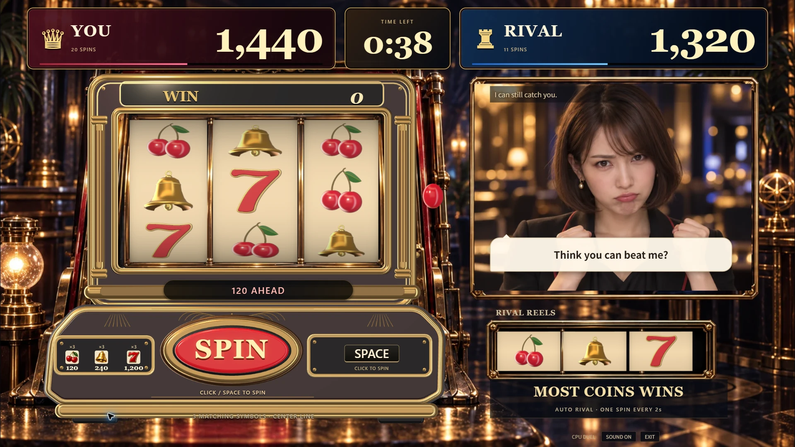
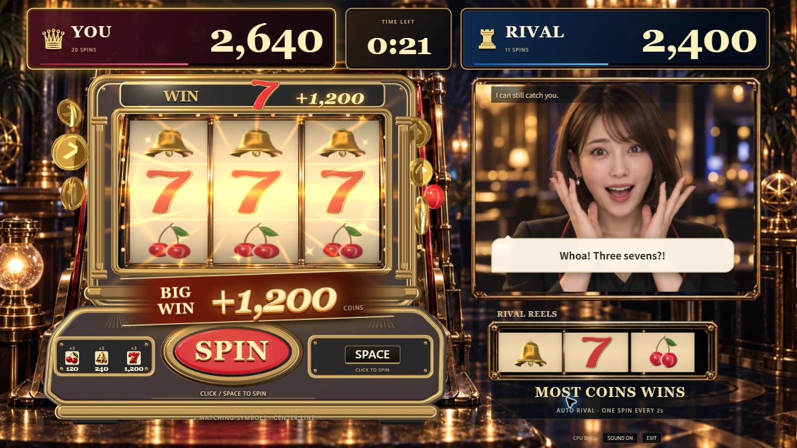
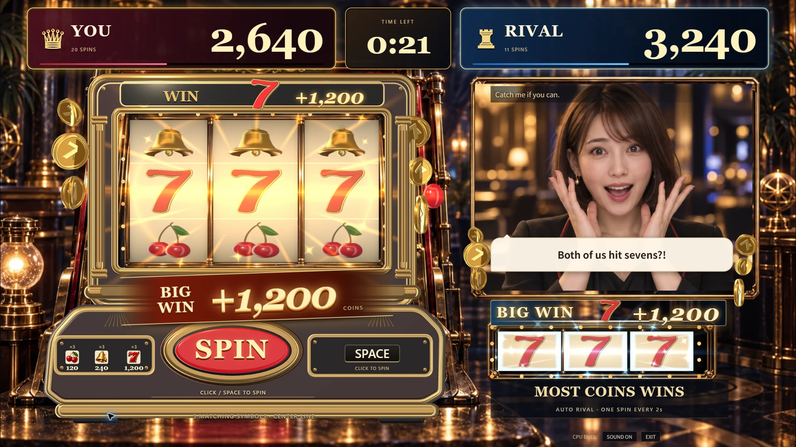
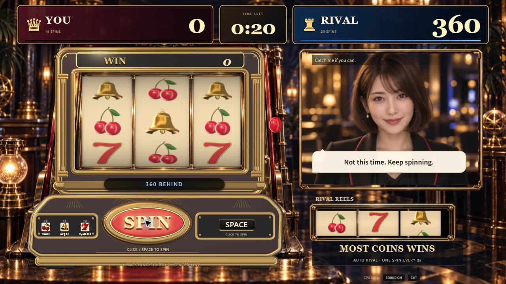
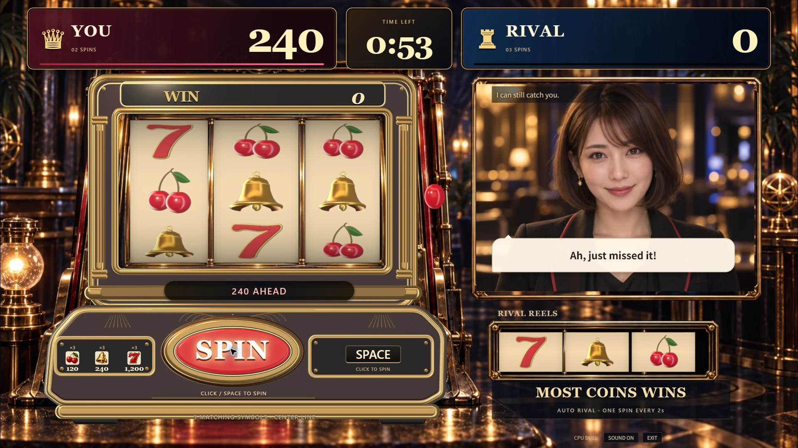
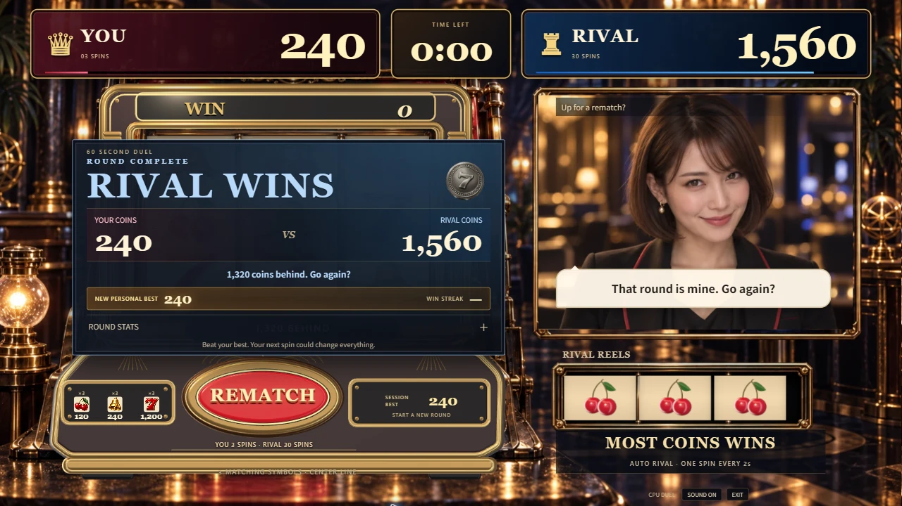

# 7と筐体の見た目の仕上げ

この資料はPR #107時点の制作記録。ゲーム画面で見つかった背景との二重写り・光・配置の不揃いは、[画面全体の改善記録](game-art-direction.md)へ続く。

2026-09-13、Issue #108 / PR #107。初版の角張った7と箱形の筐体を、曲面・材質・リールの絵柄まで見直した。**PR #107をマージし、[公開デモ](https://slot-chan.vercel.app/)へ反映済み。**

## 見た目を変えた点

| 対象 | 仕上げ |
| --- | --- |
| 7 | 旗のうねり、曲がった脚、広がった裾をベジェ曲線で制作。丸い金縁、暗い内縁、赤いエナメル面で厚みを出した |
| 窓枠と柱 | 平たい面取りから丸い断面の金枠へ変更。二重の細い縁と溝のある柱を加え、光が縁に沿うようにした |
| 側板と操作盤 | 奥へ絞った形と丸い肩、張り出す操作盤を制作。側面にも二重の金枠と扇形の装飾を加えた |
| 材質 | 正面に背景写真を貼る処理を撤去。正面と側面を同じ濃いワイン色の塗装に統一し、金属に細かい加工目を追加した |
| ボタン・窓 | 赤いエナメル、丸い金属の台座、黒い継ぎ目を重ねた。窓には薄いガラスの反射を追加した |
| 回転リール | ベル・チェリー・7を立体モデルから画像へ描画し、通常回転とWIN表示の形・色を揃えた |

写真の参考画像そのものを立体復元したものではなく、実時間描画用のスタイライズしたモデル。ゲームの背景とライバルは既存画像を使う。細かい配当アイコンも既存画像を維持している。

## ゲーム画面

通常画面でも3種類の絵柄と窓枠の質感が見える。下向きの回転、得点、英語UI、当たり表示、クリック・Spaceの操作配置は維持した。以下の通常・7揃い画面はDEVの固定局面で、実際の抽選結果ではない。

回転リールは、同じThree.jsレンダラーで起動時に作る1536×512の共有画像を使用する。曲面のリールに画像を貼る方式で、毎フレーム9個の立体絵柄を描画する方式ではない。WIN表示は実際の立体モデルを使う。生成画像と一時的な影のバッファを適切な所有元から破棄する。

通常CPU対戦は本番ビルドをローカルChromeで確認した。無操作中にプレイヤー0回・相手3回となり、相手の独立回転を確認。クリックとSpace予約を含む14回転で、相手30回転との60秒対戦を完走した。結果は0対840点。REMATCHで両者0点・0回・1:00へ初期化し、再戦のSpace予約で2回転した後、EXITで入口へ戻れた。

## モデルと実測

| モデル | 三角形数 | OBJ容量 |
| --- | ---: | ---: |
| 7 | 6,252 | 321,351 bytes |
| 筐体 | 36,974 | 1,982,633 bytes |

Houdini Apprentice 22.0.429で生成し、保存したネイティブシーンを別のHoudiniプロセスで読み直して同数の形状を再生成した。5つのOBJの有限座標、三角形、法線の向きを確認済み。編集用の`.hipnc`はGit対象外で、制作スクリプトとOBJを管理する。[再生成手順・材質を変更する場所](../art-source/houdini/README.md#7と筐体)。

- Chromeを前面にした1920×1080の既存DEV計測で、8秒の回転・当たりは408サンプル、中央値16.7ms、p95 16.8ms。最大33 draw calls / 80,894三角形。このPCでの1回の結果で、他のPCの性能保証ではない。背景化で約1秒間隔になった先行計測は採用していない。
- 通常局面の静止5秒は追加描画0フレーム。定常時17 draw calls / 36,894三角形。描画領域は1つ、生成した絵柄画像は両者で共有する。
- 型検査、lint、既存235テスト、本番ビルド、Node ESMのAPI起動確認が成功。演出用の新規テストは追加していない。
- 主JSは792.90KB gzip、CSSは6.22KB gzip。曲面のOBJを主JSへ含めるため、初版の386.12KB gzipより転送量が増えている。Viteの大きいチャンク警告は残る。
- [実装CI](https://github.com/yuin15/donburi-g/actions/runs/34716219488)は成功。音声・映像APIはこの制作と確認では使っていない。

証拠画像はCPUと固定局面だけを収録し、APIキー、環境ファイル、招待コード、メールアドレス、実際の会話を含めない。素材はApprenticeで制作したゲームソンの非商用デモ向け。[制作元と利用条件](../art-source/houdini/README.md)。

## 公開反映

ユーザーから公開とマージの指示を受け、PR #107を`main`へマージした。マージコミットは`b91cf95c3d073f7b2057b5ef1d3c7aae1bfd623c`。[マージ後CI](https://github.com/yuin15/donburi-g/actions/runs/34716975443)も成功。

Vercelの本番デプロイ`dpl_AKUTGMNp1hUAGGMSNfBtDzMmrYkb`がREADYとなり、`slot-chan.vercel.app`へ割り当てられた。ビルドは約19秒。公開JSは`index-A1LCvRUt.js`、CSSは`index-Cc9CF3BY.css`。公開JSのSHA-256は確認済みローカルビルドと一致した。

公開Chromeで1920×1080の3D筐体、丸い金枠、7・ベル・チェリーのリールを実画面で確認した。クリック・Space予約で手動3回/240点、相手の独立回転30回/1,560点で60秒を完走。1280×720の結果画面、REMATCHで0点・0回・1:00への初期化、再戦のSpace予約による2回転、EXITでの入口復帰を確認した。

当該デプロイのerror/fatalログを照会し、該当記録はなかった。外部の監視や通知は追加していない。公開確認に音声・映像APIは使用していない。
