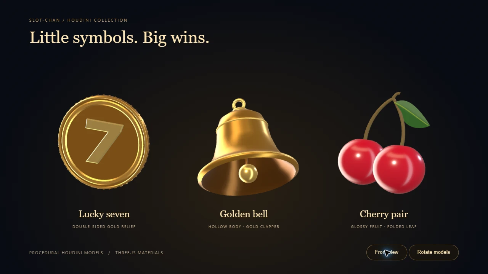
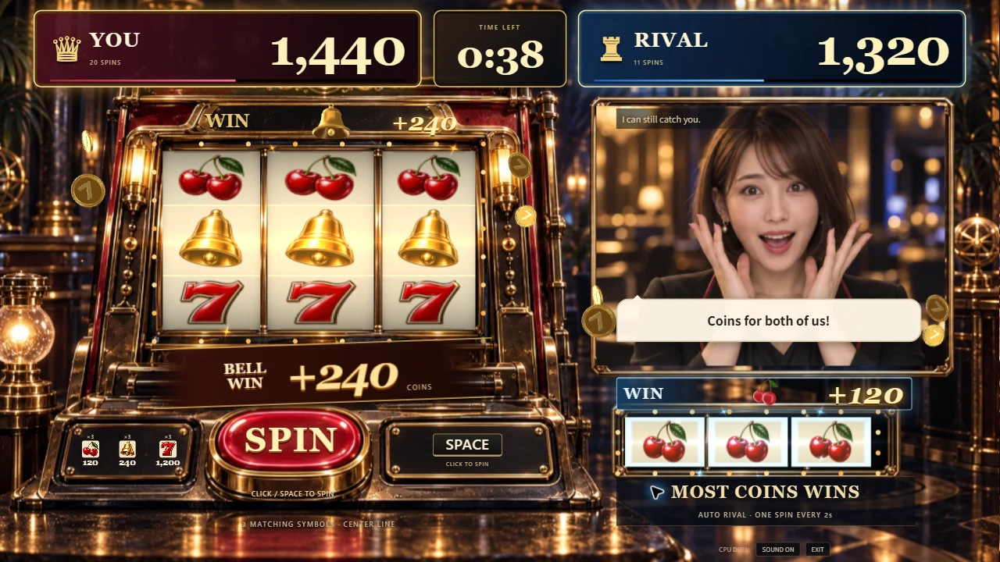

# ベルとチェリーの立体モデル

ベル・チェリーが揃うと、WINと獲得コインの間に同じ種類の立体モデルを表示します。ベルは揺れ、チェリーは弾みます。リール・得点・ライバルの顔を読みやすく保ちながら、小当たりにも種類ごとの反応を付けました。

上の対戦画面はAPIを使わない開発用の固定局面です。モデルの種類と当たった側を同時に見比べています。[1920×1080で左右の種類を入れ替えた画面](evidence/houdini-symbols/cherry-bell-1920.webp)も確認しました。

## 制作と取り込み

Houdini Apprentice 22.0.429のPython SOPから実際に生成・OBJ出力しました。ベルには開いた裾、内側、舌、吊り輪があります。チェリーは2つの実、曲がった茎、折れ目のある葉と葉脈を持ちます。

| モデル | 三角形 | OBJのサイズ |
| --- | ---: | ---: |
| コイン | 2,956 | 159,562 bytes |
| ベル | 3,872 | 213,261 bytes |
| チェリー | 3,232 | 193,685 bytes |

OBJの同一座標・法線をまとめ、3モデル合計を1,423,229 bytesから566,508 bytesに削減しました。整理前後で全三角形の座標・法線・部位名を展開して比較し、一致を確認しました。法線と逆向きの面は0でした。

Three.jsでは形状を両者で共有し、コインと同じ反射マップを使います。ベルは1描画、チェリーは果実と葉・茎の2描画です。停止中に新たなモデルを取得せず、ゲーム起動時に準備します。モデル・材質はView層に置き、抽選や配当、回転間隔は変更していません。

再生成コマンドと編集場所は[制作元README](../art-source/houdini/README.md)。ネイティブシーンはGit対象外の`.art-build/`へ生成します。通常のゲーム起動にHoudiniの導入は不要です。Apprenticeによる非商用デモ向け素材として扱います。

## 見直しと確認

- 実Chrome、1280×720と1920×1080で、両者のベル・チェリー、得点との余白、リールの比率を確認しました。
- 相手側のモデルを隠していたWIN帯の背景を調整しました。次の回転では、その側のマークを消し、すでに飛んでいるコインだけが飛び終わります。
- 動きを減らす設定ではモデルを静止表示し、コイン・星の移動を省きます。
- 8秒の回転・当たりを録画。動作中405サンプルのフレーム間隔は中央値16.7ms、95パーセンタイル16.8ms。最大25描画・37,954三角形でした。このPCでの1回の測定であり、全PCでの性能保証ではありません。動画はThree.jsの描画部分のみで、音声とHTMLの得点表示は含みません。
- 待機5秒の追加描画は0フレームでした。
- 本番ビルドをローカルChromeで操作し、クリック・Spaceの予約、8回/240点対30回/840点の60秒完走、結果、再戦時の0点・0回への初期化を確認しました。公開サイトへの反映確認とは分けています。
- 型検査、lint、既存234テスト、Node ESMサーバー確認、本番ビルドに成功しました。主JSは284.46KB gzip、CSSは6.06KB gzipです。既存の大きなチャンクに関するビルド警告は残っています。

制作・画面確認に音声や映像APIは使用していません。変更ファイルと配布用ネイティブシーンに、キー形式の秘密値やメールアドレスのパターンがないことも確認しました。
