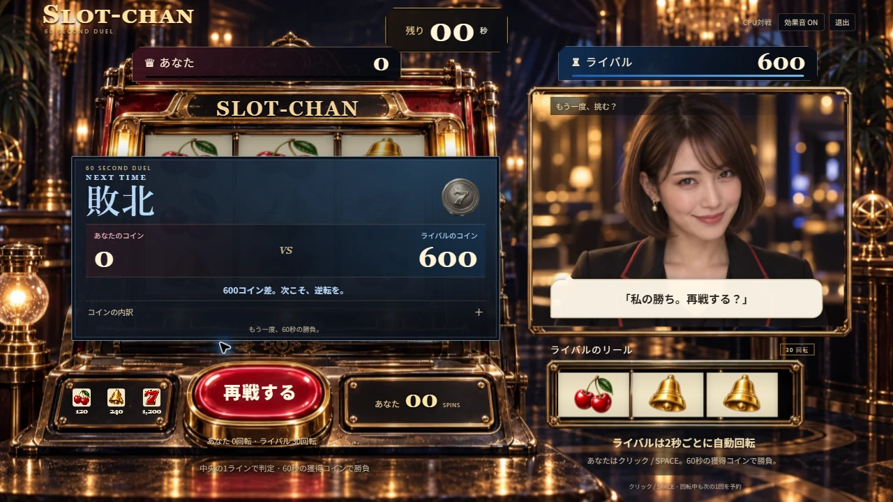
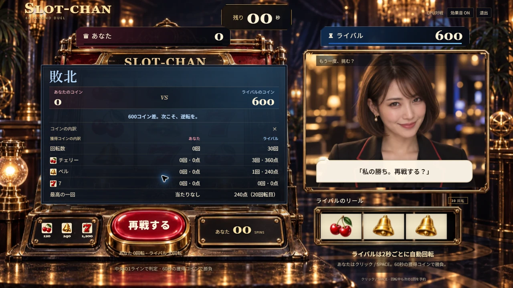

# 独立したライバル回転と改造の撤去

2026-09-12。#78 / #79。プレイヤーはクリック・Space、ライバルは2秒ごとの自動回転。20/40秒の改造を撤去した。

## 実画面

- ローカルChrome、1280×720。無操作で60秒を完了し、プレイヤー0回/0点、ライバル30回/600点で決着した。
- 結果の内訳はチェリー3回=360点、ベル1回=240点、7は0回。最高はライバル20回転目の240点。合計600点と一致。
- 詳細を開いても再戦ボタンは見え、再戦で左右の得点・回転数が0へ戻った。
- 再戦でSpaceを6回操作。左右の回転数が3対1、4対2、6対3となり、両側同時の回転も片側だけの回転も確認。相手の自動回転は入力に連動しない。
- 小リールの絵柄の縦横比と、下向きの動きを維持した。

## 確認

型検査・lint・215テスト・本番ビルド成功。無操作、連打、60秒の境界、左右の異なる最終回転数、片側の停止で他方の予約・演出を壊さないこと、通信欠落からの左右別snapshot復旧を確認した。

WebSocket結合試験は実localhost通信で、認証・外部AI・音声プロバイダーは代替している。実音声や有料API接続の確認を意味しない。

公開版での確認はデプロイ後に追記する。
