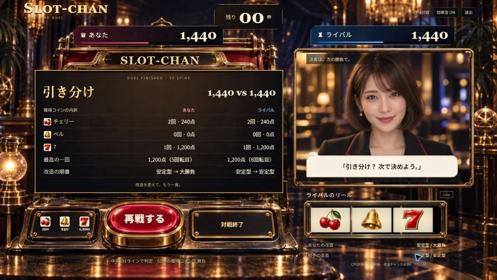
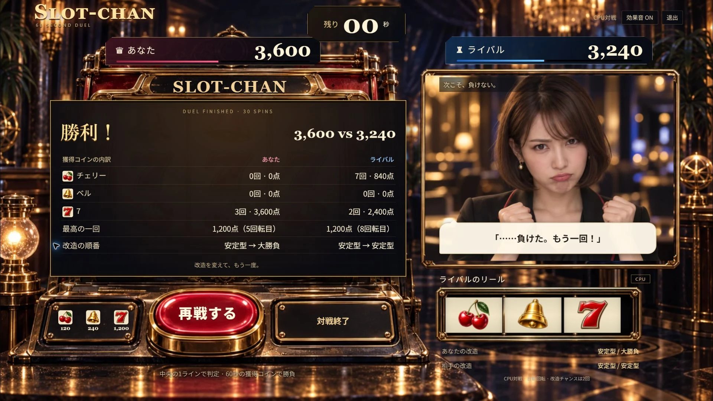

# 対戦の反応と結果の振り返り (#50 / #51 / #52)

2026-09-12。CPU対戦の反応を両者の確定出目に合わせ、結果から改造と配当を振り返れるようにした。

## 実装

- CPUの反応は両者7揃い、片側7揃い、逆転、両者小当たり、片側当たり、終盤僅差、外れの順。各場面の短文を循環し、外れで古い大当たり台詞を残さない。終盤僅差は残り0秒超〜10秒・差240点以内。最終勝敗は確定後の結果表示で伝える。
- 結果は両者の絵柄別当たり回数・獲得点、改造順、最高配当の最初の回転を表示する。確定spinを共通ドメインで一度だけ集計し、snapshotに深い複製を含める。描画の間引き・欠落で内訳を失わない。
- wireはstats必須。回数、合計点、最高配当と回転の整合を確認し、不完全な結果を表示しない。
- Live字幕は実transcriptを優先。結果の定型文・作戦文・2.5秒の文字列クリアで表示を上書きしない。再戦の準備時に0対0・60秒・未改造へ戻す。

## 検証

- 型検査・lint・163テスト・生成Node ESM起動/拒否応答・本番ビルド成功。
- CPU反応21ケース。相手の7揃いが自分の小当たりより優先、同時7揃い、外れへの更新、同文の連続回避、再戦初期化を確認。
- 実ドメイン4seed各30回転の配当合計との一致、60秒への一括追いつき、snapshotと試合の独立、wireの欠落/不整合拒否を検証。
- ChromeのDEV検収で[CPU台詞の3場面](evidence/match-feedback/reaction-scenes.json)を操作。
- [Live表示順の代替検収](evidence/match-feedback/live-ui-fixture.json)では、字幕→未発声作戦文→結果表示→2.8秒経過でも字幕を保持。再戦準備は0対0・60秒・未改造で内訳を消去。これは表示処理の検証であり、実API音声・マイク・Live接続の証明ではない。
- 1280幅の結果本文は約13.4px。セル・パネルの内容あふれなし。1920幅でも最終スピン後に結果を表示し、再戦ボタンはパネル外で操作できる。

## 自然抽選の通し対戦

[ローカルの表示記録](evidence/match-feedback/local-flow.json)では60秒で1,560対600の勝利。あなたはチェリー7回840点＋ベル3回720点、相手はチェリー3回360点＋ベル1回240点で、両者とも内訳合計が結果と一致した。あなたの改造は既定の安定型2回、相手は大勝負2回。

[再戦の記録](evidence/match-feedback/local-rematch.json)は0対0・60秒・未改造、結果非表示・内訳行0。Enterでカウントダウンを取消。JavaScriptエラー0。

主JS 134.69KB gzip、CSS 4.13KB gzip。検収ツール・固定出目・代替字幕の文字列は本番JSに含まれない。公開記録は検証後に追記する。実プロバイダーの旧音声中断は #8 に残し、`LIVE_MODE_ENABLED=false`を維持する。
