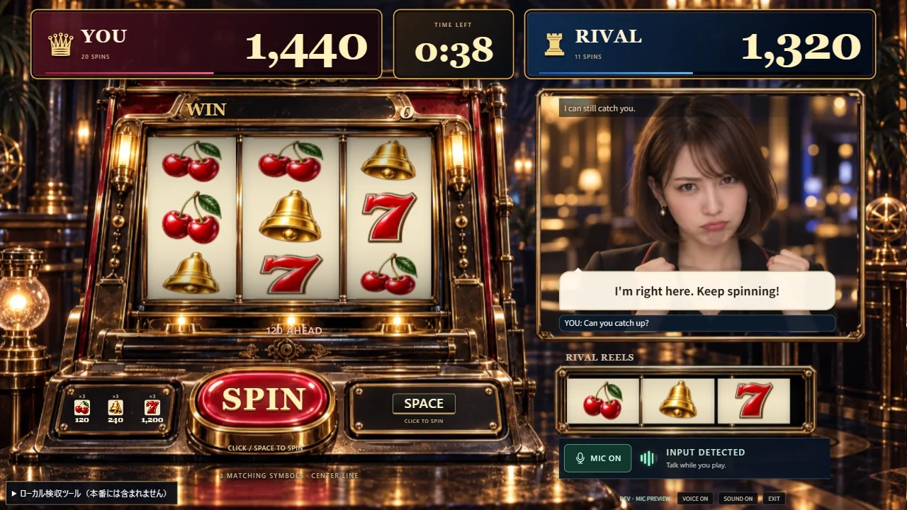
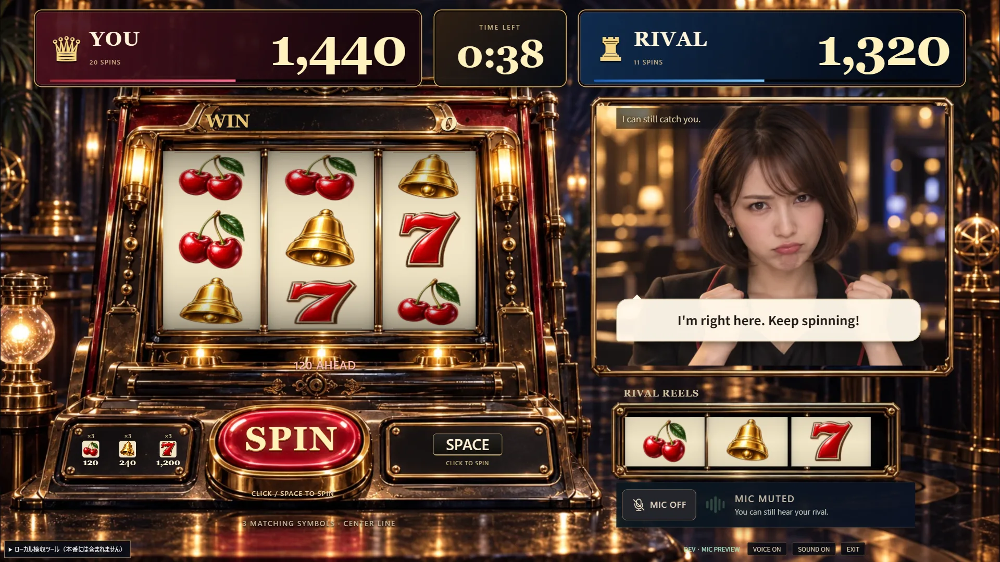

# マイク入力の表示と操作（#92）

音声対戦では、ライバルの小リールの下に入力メーターとMIC ON/OFFを表示する。CPU対戦では既存のルール案内を維持する。

- **MIC ON**: マイクが音を拾うと5段階のバーが点灯する。INPUT DETECTEDはブラウザ側の入力を示し、AIの認識・返答成功とは区別する。
- **MIC OFF**: マイクトラックを無効にし、送信データも無音にする。相手の声と対戦は継続する。VOICE OFFは相手の再生音声だけをミュートする別操作。
- 結果では入力を終了し、終了・切断時にはメーターを消す。マイクを外した場合は任意音声を終了し、対戦用の接続を維持する。
- マイクのミュート設定は再接続にも適用する。マウスでミュートを切り替えた後は、プレイ中のSpace回転へ戻れる。

音声入力はMicrophoneInput、接続通知はLiveSession、状態と操作はGameViewModel、表示はGameViewが担当する。UI更新は入力の音声時計で約8回/秒以下、同じレベルは通知しない。CPU入口で音声処理を読み込まず、音声・会話・デバイス名を保存しない。

## 画面確認

ローカルChromeの明示的なDEV表示例を1280×720と1920×1080で確認した。以下は合成された表示状態で、マイクの実録音や実際の会話を含まない。字幕には濃色の背景を付け、ライバルの枠内へ収めた。メーター、ボタン、字幕、下部操作の重なりと横方向のはみ出しはない。

## 動作の確認範囲

既存のブラウザ音声接続テストに、入力波形→メーター、ミュート時の全ゼロPCM、解除後の入力復帰、結果での入力停止、マイク切断後もゲーム接続を残す確認を追加した。ViewModelではミュートと再生音量が独立し、古い接続からの入力通知を無視することを確認した。

ローカル実Chromeでは既存のマイク許可でVOICE READYへ接続し、MIC OFFの0バー、MIC ONへの復帰、マウス操作後のSpace回転を確認した。画面例・代替入力の動作確認を人の実発声や聴感評価とは扱わない。返事の速さ・実際に聞こえる割り込みは引き続き#8で確認する。
