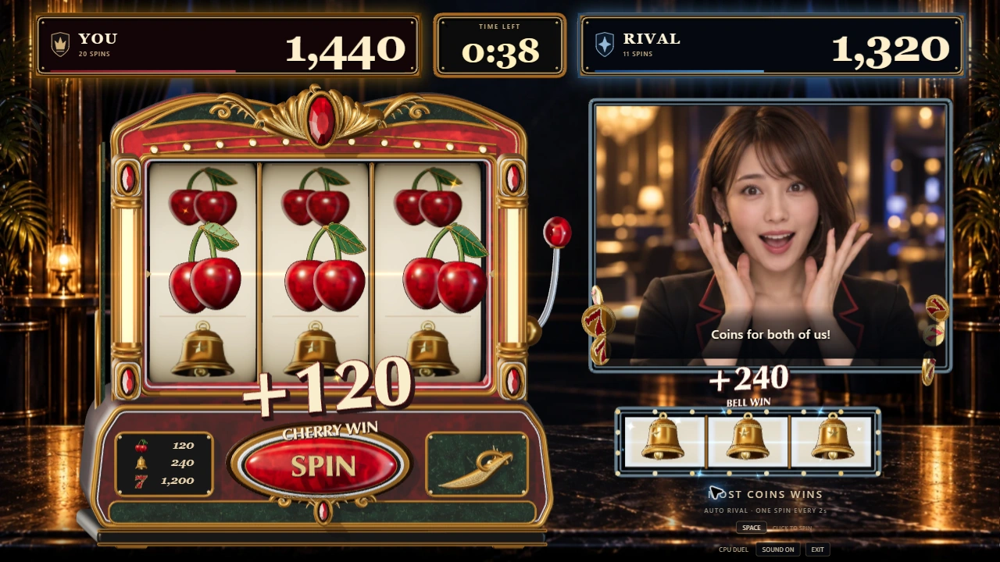
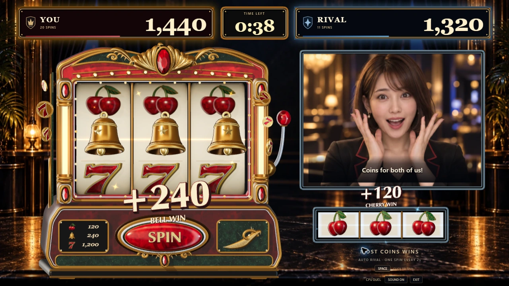
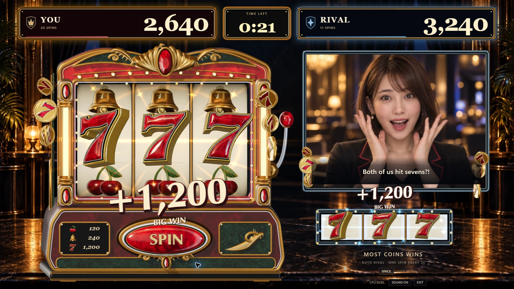
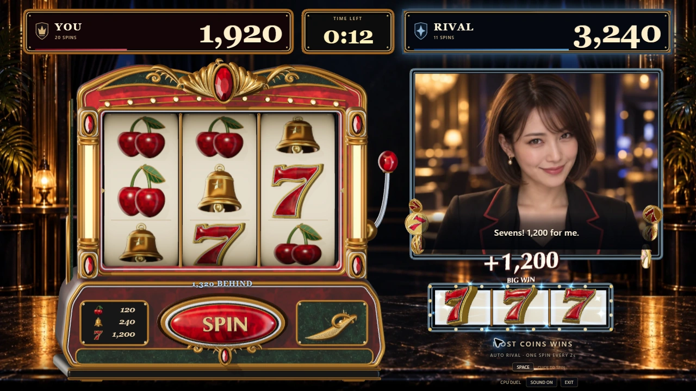
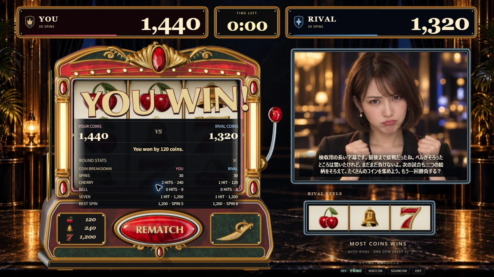
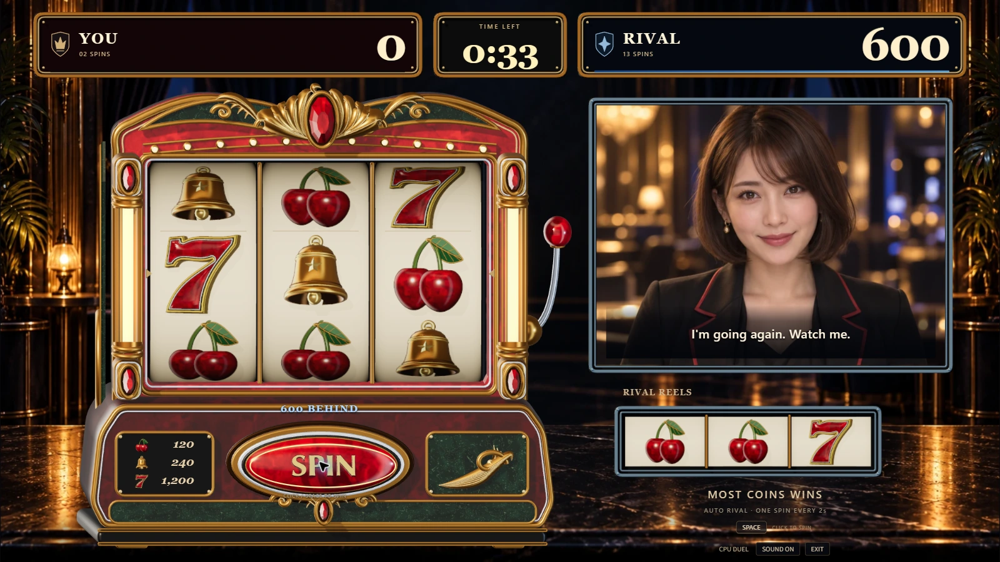

# 立体の当たり演出

2026-09-13。Issue #112 / PR #113。ゲームソン向けに、当たりを通知パネルから筐体の中で起こる立体の出来事へ変更した。

## 制作の基準

[画像生成で作った完成像](art-reference/04-physical-win-direction.png)を基準に、LOCK → LIFT → COLLECT の流れを実装した。[生成方法・入力画像・全文プロンプト](art-reference/README.md#04-physical-win-direction)。生成画像は制作目標であり、実ゲームのスクリーンショットではない。

- **LOCK:** 確定した中央の3絵柄を、同じHoudiniモデルの実メッシュへ切り替える。ドラム側に柔らかい接地影を残し、同じ絵柄の二重写りを防ぐ。
- **LIFT:** 3絵柄がリールから前にせり出し、それぞれ少し異なる角度で側面・厚み・光沢を見せる。ベルは揺れ、チェリーは弾む動き、7は大きく重い登場。金の獲得数字と赤い側面、金属の面取りも実ジオメトリ。
- **COLLECT:** コインが筐体の外側を奥行きのある曲線で通り、得点側へ収束する。文字は回転して現れ、上へ収まりながら消える。筐体の反動と移動する照明も同じ演出時間で動く。

獲得数字の矩形カードは撤去。得点・時間の枠、SPIN / REMATCH、結果の見出しもThree.jsの立体にした。ライバルの大きな白い吹き出しは映像下の字幕へ整理し、顔と両者の得点を残す。得点の数字、操作・フォーカス、会話、詳しい結果はDOMに置き、読みやすさとキーボード操作を維持する。

## 実ゲームの表示

以下はDEV専用の固定局面をChromeで表示した画像。通常抽選で出た結果・実マイクの会話ではない。

1280×720で通常・チェリー・ベル・7・相手の当たり・結果・詳細・長い字幕を確認。1600×900で同時当たりと動きを確認した。初回確認で見つけた獲得数字のカンマと小見出しの接触、配当表の絵柄と数字、結果詳細と立体見出しの重なりを修正した。

[当たりの8秒動画](evidence/physical-win/sculpted-wins-1600.webm)はThree.jsのキャンバスを収録したもの。回転・ベル・チェリー・7の演出を比較できる。DOM側の得点・字幕や音声は動画に含まれない。

## 負荷と維持した動作

3つの絵柄はInstancedMeshで形状・材質を共有。文字の形状も表示内容ごとに再利用し、毎フレーム生成しない。24枚のコインと1つのRendererを維持する。次の回転を始めたら、その側の立体絵柄をリールから退ける一方、前の当たりの文字・コインは元の寿命まで残す。

Chrome・1600×900で約8秒の回転と当たりを計測し、359サンプルのフレーム間隔は中央値17.6ms、95パーセンタイル18.1ms、ピーク114描画呼び出し・469,285三角形。[計測値](evidence/physical-win/performance.json)。このPCでの短い計測であり、常時60fpsや別PCの速度を保証するものではない。

静止5秒の追加描画は0回。[待機の計測値](evidence/physical-win/idle.json)。動きを減らす設定では、せり出し・回転・筐体の反動・飛ぶコインを抑える。[その実画面](evidence/physical-win/reduced-motion-1280.webp)。

手動クリック・Space・1回の予約、2秒ごとに独立して回る相手、60秒の勝敗、再戦、任意の音声・映像の境界は変更しない。Model / ViewModel / 通信コードは変更していない。今回の確認では音声・映像APIを呼ばず、実マイクの聴感を評価したとは扱わない。

型検査・lint・既存235テスト・サーバーの実行形式チェック・本番ビルドが成功。新規テストは追加せず、既存の描画テストを筐体のグループ階層と複数材質に対応させた。フォントはThree.js同梱Optimer Boldの大文字・数字を抜粋し、元の許諾文を同梱した。秘密値・個人メール・実会話は含めていない。
## 公開確認

PR #113をマージし、公開サイトに反映した。公開JSとマージ後ビルドのSHA-256が一致。[公開記録](current-status.md#立体の絵柄獲得数字筐体の動き)。

公開Chromeで手動2回・0点対相手30回・720点の60秒対戦、結果、再戦の60秒・0回・0点への初期化、Space予約を確認した。以下は公開版の通常抽選による対戦であり、固定局面ではない。

公開結果の見直しで、結果の下に対戦中の得点差が重複して残る箇所を修正。結果が出たら得点差を隠し、勝敗・両者の得点・結果詳細へ表示を集約する。
