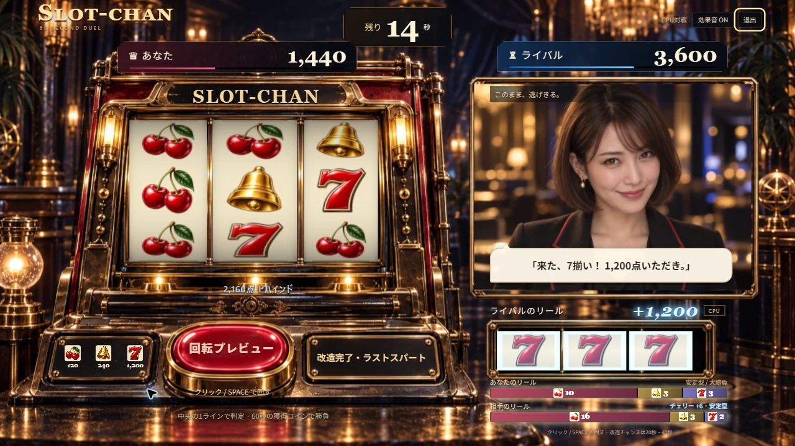
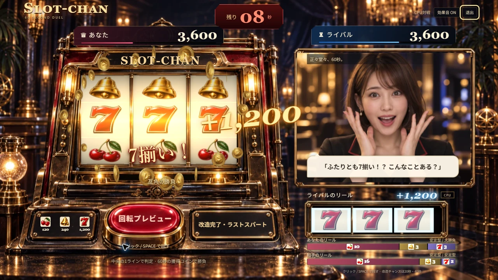
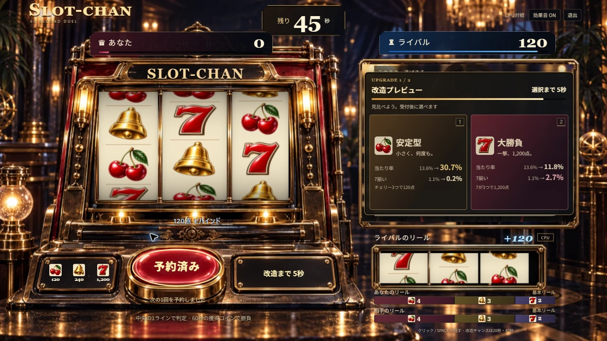

# 相手の当たり・改造と連打中の加点表示

Issue #68。相手の当たりを小リールの青い縁光と加点で知らせ、自分の金色の演出と見分けられるようにした。相手だけの当たりで自分側の金貨は出さない。

手動回転の最速予約では、停止の約50ms後に次の回転が始まり、前の加点と金貨も消えていた。次の回転では当たりラインを消し、加点と金貨は本来の650ms／7揃い1200msまで残す。次の停止・再戦・退出・結果で表示を整理する。相手の縁光も通常650ms／7揃い1200ms、動きを減らす設定では180msで終了する。静止・非表示時は連続描画しない。

相手の構成バー上に、20–24秒／40–44秒は「リール改造中」、確定後3.5秒は追加した絵柄と枚数を表示する。確定済みsnapshotだけを使い、台詞の更新とは独立させた。

## 確認

- 型検査・lint・208テスト・生成済みNode ESMの起動／拒否応答・本番ビルド成功。主JSは138.00KB gzip、CSSは5.48KB gzip。既存の500KB超ビルド警告は残る。
- DEV固定出目で相手だけの7揃いと両者7揃いを1280×720で目視。相手だけの場合は自分の加点なし、両者の場合は金と青の加点を別の場所に表示する。固定出目は本番に含まれない。
- 通常CPU対戦を前面のChromeでSpace連打。127回のDOM観測で、回転中にも自分・相手・両者の加点が残ることを確認。相手の改造中→「7 +1 · 大勝負」→通常の構成表示への復帰も確認。JavaScriptエラー0。観測はローカル実行で、実APIを使用していない。
- 描画テストで片側／両側の発光期限、次回転での発光解除と金貨の寿命、非表示からの復帰、停止・破棄、静止プレビューを確認。

実プレイ観測: [local-flow.json](evidence/rival-feedback/local-flow.json)。
