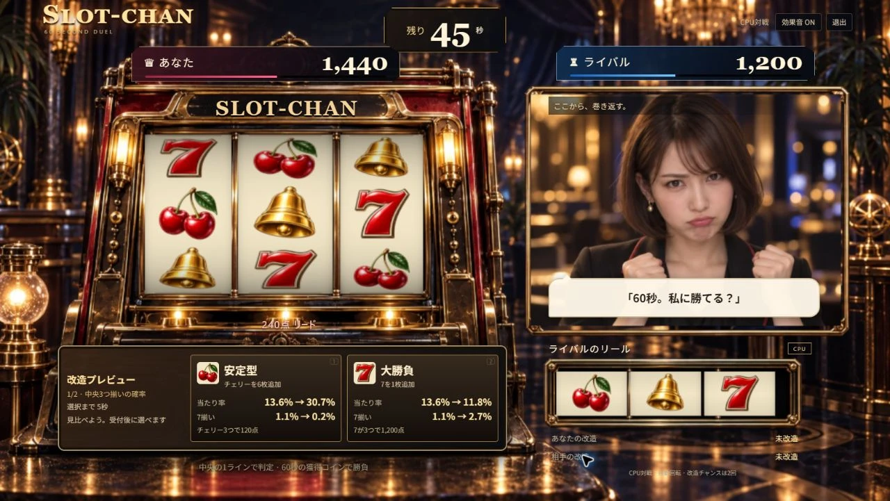
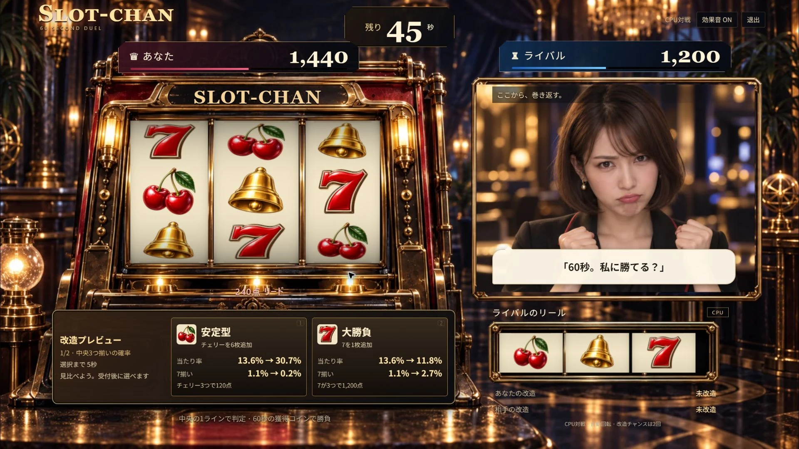

# 改造を見比べて選ぶ (#46)

2026-09-12。PC用の改造カードに、受付前の5秒プレビューと現在→改造後の確率を追加した。受付は従来どおり20–24秒・40–44秒。抽選、配当、CPUの選択、公平性は変更していない。

- 安定型: 初期の当たり率13.6%→30.7%、7揃い1.1%→0.2%。
- 大勝負: 初期の当たり率13.6%→11.8%、7揃い1.1%→2.7%。
- 確率は共通の初期プール・改造定義から算出。表示は小数1桁に丸める。全絵柄の組合せを列挙する独立検証と、全4通りの改造順を実ドメインへ適用する6テストが成功した。

## Chromeでの通し確認

自然抽選の60秒対戦を実際に操作した。[DOM記録](evidence/upgrade-preview/local-flow.json)。

1. 残り45秒からプレビュー。両ボタン無効、数字キー2でも早期選択できない。
2. 残り40秒で4.0秒の受付。1回目は未選択のまま期限を迎え、「未選択のため安定型を適用」と表示。
3. 残り25秒の2回目プレビューは確定済み安定型を反映。当たり率30.7%を基準に、安定型44.6%・大勝負25.7%を比較。
4. 残り20秒で大勝負を選び、ボタンが固定。残り16秒で「安定型 / 大勝負」と適用通知を確認。
5. 60秒・30回転で600対600の引き分け。再戦は0対0・未改造に戻り、Enterでカウントダウンを取消。JavaScriptエラー0。

1280×720 / 1920×1080でカードを目視。最小サイズの各カードに内容のあふれはなく、入口も主要操作が画面内に収まる。1280幅の画像高さ721pxはステージの比率丸めによる。

型検査・lint・117テスト・生成Node ESMの起動と拒否応答・本番ビルドが成功。#47 / #48 の追加ケースを含む。主JS 133.38KB gzip、CSS 3.89KB gzip。500KB超のチャンク警告は残る。実音声APIは使用していない。

公開確認はデプロイ後に追記する。
